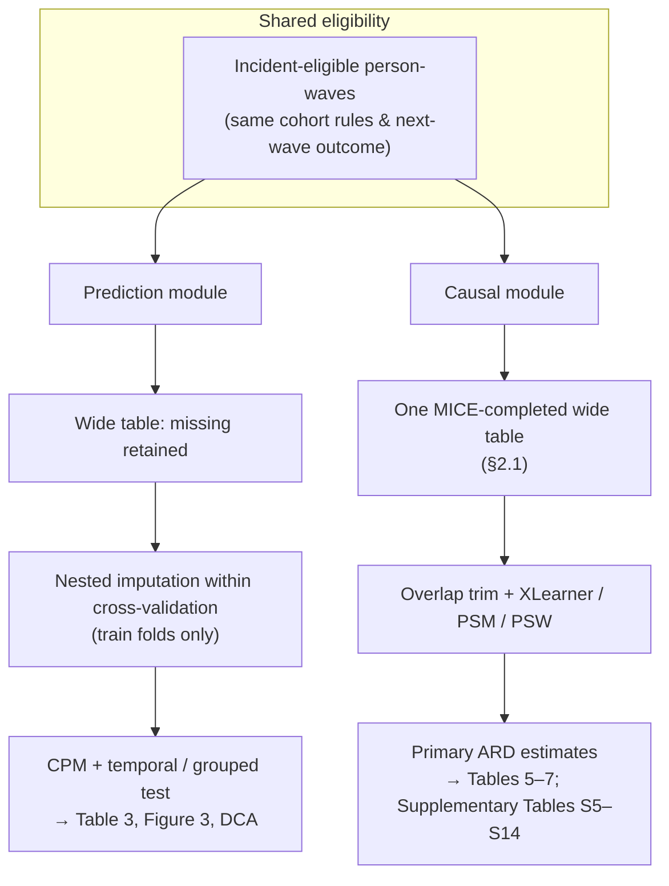

# Manuscript for Submission

**Target journals:** *The Lancet Digital Health*, *BMC Medicine*, *Journal of Affective Disorders*, *Aging & Mental Health*, or similar

---

# TITLE PAGE

**Title:** Leveraging Causal Machine Learning to Map Phenotype-Specific Actionable Windows for Lifestyle Interventions in Depression–Cognition Comorbidity: A Life-Course Cohort Analysis of CHARLS

**Short title:** Causal machine learning, phenotype stratification, and lifestyle windows for depression–cognition comorbidity in CHARLS

**Authors:** [Author 1]¹, [Author 2]², [Author 3]³, …  
*[Please insert author names and affiliations]*

**Corresponding author:**  
[Name], [Address], [Email], [Phone]

**Word counts:** Abstract (structured **Background–Conclusions**): **~300** words. Main text (sections **1–4** narrative): **~7,600** words.

**Number of tables:** Seven main tables plus supplementary tables (structured list and extended numeric appendices in Supplementary Materials).  
**Number of figures:** Five main and five supplementary. **Legends** and **table notes** are collected under **Figure Legends** and **Tables**; supplementary items are listed under **Supplementary Materials**.

**Keywords:** Depression–cognition comorbidity; DCC; Causal machine learning; CHARLS; XLearner; SHAP; Predictive modeling; Life-course epidemiology; Older adults; China

**Highlights (for cover pages / journal submission forms)**  
- Nationally representative CHARLS person-waves were classified into three incident-eligible baseline phenotypes; incident DCC incidence rose markedly (**24.4, 84.4, and 107.1** per 1,000 person-years in Cohorts A, B, and C). **Cohort A** (**precision prevention window**) achieved the strongest discrimination (champion test AUC **0.72**) for precision prevention (**actionable-window profile: strong discrimination + no significant population-average PSW exercise effect**); in depression-only **Cohort B** (**direct intervention window**), **PSW** showed a **significant exercise association** (**ARD −3.1** percentage points, **95% CI −5.6% to −0.7%**) on the next-wave DCC absolute-risk scale, whereas **XLearner** was borderline, underscoring estimand-dependent inference and the need for pragmatic trials.  
- Cohort C exercise–DCC patterns reflect **selection and reverse causation** and should not be interpreted as harm from physical activity; chronic multimorbidity burden was a baseline confounder only, and no causal contrasts for burden are reported.  
- A **falls** negative control and **decision curve analysis** support **targeted** versus **blanket** lifestyle strategies; **E-values** for Cohort B exercise are **modest** [11], so **hypothetical unmeasured confounding** of **moderate strength** could still shift intervals.

**Conflict of interest:** The authors declare no conflicts of interest.

**Funding:** The authors received no specific funding for this work.

**Data availability:** CHARLS data are publicly available at http://charls.pku.edu.cn/. **Study replication code** includes an optional **Streamlit** web application (`streamlit_shap_three_cohorts.py`) that loads cohort-specific **CPM champion** classifiers and supports **manual covariate entry** with **local SHAP** visualisation for **illustration and teaching** only (**not** a medical device and **not** for clinical decisions); setup is documented in the replication package (**`docs/SHAP_Streamlit_三队列使用说明.md`**).

---

# ABSTRACT

**Background.** Depression–cognition comorbidity (DCC) was defined as co-occurring depressive symptoms (CES-D-10 score ≥10) and cognitive impairment (cognitive score ≤10), consistent with standard CHARLS mental-health metrics. Incident DCC was new co-occurrence at the next survey wave among those without prior DCC. Rapid population ageing in China heightens the need to know which baseline phenotypes should prioritise screening versus lifestyle promotion when uptake is selective.

**Methods.** We analysed **14,386** incident-eligible person-waves from **7,027** adults aged **≥60** in CHARLS. The outcome was incident DCC at the next wave. Prediction used grouped *k*-fold cross-validation, temporal hold-out, and fold-wise multiple imputation by chained equations (MICE). Primary causal estimation fitted one prespecified MICE-completed dataset, with **five** independent multiply imputed replicas and Rubin-rule pooling as sensitivity. We estimated contrasts for four modifiable lifestyle factors: regular exercise, current drinking, social isolation, and normal BMI (**18.5–24 kg/m²**); chronic disease burden entered **only** as a baseline covariate. **XLearner** (random-forest stages, propensity trimming **0.05–0.95**, **200** cluster bootstrap resamples by participant) was triangulated with propensity-score matching and **PSW** (**propensity score weighting**; **inverse probability of treatment weighting** **is** **synonymous**—**§2.6**) (**distinct estimands**). **CausalForestDML** double machine learning provided a doubly robust cross-check.

**Results.** Intervention priority shifted across phenotypes: incident DCC density increased from **24.4** through **84.4** to **107.1** per **1,000** person-years across Cohorts A to C, while test discrimination was strongest in the healthy stratum (**AUC 0.72**). Exercise contrasts moved from no clear population-average propensity-score weighting (**PSW**) signal in Cohort A to a statistically significant **PSW** contrast in depression-only Cohort B (**absolute risk difference, ARD: −3.1** percentage points, **95% CI −5.6% to −0.7%**), alongside borderline **XLearner** and **PSM** intervals that included the null. Rubin-pooled **XLearner** for Cohort B was **−2.13%** (**ARD**; **95% CI −4.43% to +0.17%**). Cohort C **XLearner** patterns were compatible with selection and reverse causation, not with physical activity being harmful. Point and interval **E-values** for Cohort B exercise were about **1.59** and **1.19** [11].

**Conclusions.** Triangulated causal machine learning suggests two phenotype-specific **actionable windows** (**precision prevention window** *versus* **direct intervention window**): **precision prevention** (**Cohort A**) where discrimination is strongest (**AUC = 0.72**) but there is **no** significant population-average **PSW** exercise effect, and **direct intervention planning** (**Cohort B**) in depression-only adults with a statistically evident **PSW** exercise contrast but borderline **XLearner**. Cohort C lacks causal interpretability for curtailing activity. **Randomized controlled trials** are needed to confirm the magnitude of these effects. Observational design, residual confounding, and primary single-completed-dataset inference, with multiply imputed sensitivity in the supplement, limit generalisability.

**What this study adds** *(short bullets for journal “novelty” / significance fields; trim further if a portal enforces character limits)*  
- **Design.** Stratified causal machine learning on nationally representative CHARLS person-waves, grouped into three phenotypes with steep incident DCC gradients, integrates prediction and causal contrasts on the same next-wave outcome.  
- **Inference.** Four modifiable lifestyle factors only; chronic multimorbidity burden as a baseline confounder without causal contrasts. In Cohort B, **PSW** indicates a significant exercise association on the absolute risk scale while **XLearner** is borderline; we emphasise cross-estimator agreement.  
- **Robustness and utility.** Falls negative control, decision curve analysis, **DML** cross-check, and dual-window framing complement interpretation; Cohort C patterns are non-causal for exercise policy and should not be interpreted as evidence of harm from physical activity.

## 1. Introduction

**Depression–cognition comorbidity (DCC)** (co-occurring depressive symptoms and cognitive impairment) is a **strong marker** of **dementia risk** and **functional decline** [1]. **China’s ageing trajectory** and **uneven primary-care capacity** make it **pivotal** to know **where** to **deploy** scarce **lifestyle** counselling **first** [2,3]. **Randomized trials** in **Chinese** older adults already support **structured activity** for **cognitive frailty** and **depressive symptoms** [23,24]; **the gap** is **how** to **translate** generic “**be active**” messaging into **phenotype-specific** **prevention versus promotion** pathways at **population** scale.

**Prior analyses** typically report **adjusted** associations from **Cox** or **logistic** models with **at most a handful of interaction terms**. That approach **strains** when **lifestyle uptake is selective**, **confounding is high-dimensional**, and **heterogeneous treatment effects (HTE) across baseline phenotype** are **the estimand** of interest: **one average coefficient per exposure obscures who benefits most and which delivery model is most efficient** [4,7]. **CHARLS** provides a **nationally representative**, **life-course** observational platform for **stratified targets** **if** methods **explicitly separate** **risk ranking** from **rebalancing** **severely imbalanced** binary behaviours.

**Predictive machine learning** improves **discrimination** but **does not**, **by itself**, **elucidate causal contrasts**; **long-term lifestyle RCTs** in **frail** cohorts remain **operationally demanding**. **Causal machine learning (CML)**, including **XLearner** and **double machine learning (DML)** [5,6], targets **average treatment effect (ATE)** and **heterogeneous treatment effect (HTE)** estimates under **stated identifying assumptions** while **accommodating rich covariate adjustment** [7].

**Standard regression** still yields **one adjusted increment per exposure**, **flattening HTE** relevant to **precision policy** [7]. **In contrast**, **XLearner** **addresses extreme imbalance** in **lifestyle** data by **modelling outcome distributions separately** under **treatment** and **control** [7]. **PSM**, **PSW**, and **XLearner** **rebalance** the **same binary exposure** under **different identifying restrictions** and, **in general**, **related but non-identical estimands** (**average treatment effect on the treated (ATT)**-based matching, **PSW**-style **average treatment effect (ATE)**—**on** **the** **risk** **scale** **we** **report** **this** **as** **absolute** **risk** **difference** **(** **ARD** **)**, **meta-learned** averages); **used jointly**, they **cross-check signal** when **treatment uptake is selective**.

To address these challenges, we applied a **three-cohort** framework to CHARLS person-waves. **First**, **stratified prediction** of **incident DCC**. **Second**, **XLearner** contrasts for **four lifestyle** factors—exercise, drinking, isolation, and normal BMI—with **chronic multimorbidity burden as a baseline confounder only**; **causal contrasts for burden were not estimated**. **Third**, **PSM** and **PSW** as **parallel estimators** alongside **XLearner**. **Design** is illustrated schematically **later in the main text**. **Strong discrimination in Cohort A is not treated as sufficient grounds for universal exercise prescription**; **intervention logic** couples **prediction** with **causal contrast stability** in the **tabular results**.

**Pre-specified expectations (observational).** **Before locking primary tables**, we expected **Cohort A** to show the **highest AUC** for **incident DCC** **without** a **significant population-average PSW exercise benefit**, **so high discrimination would not imply universal promotion**. **Cohort B** was expected to show a **PSW exercise contrast with 95% CI excluding the null**—**prioritising that phenotype for trials**—even if **XLearner** stayed **borderline**. **Cohort C** exercise–**DCC** patterns were expected to be **compatible with selection and reverse causation** **without supporting reduced physical activity**.

**Analysis plan and reporting.** This work is a **secondary analysis** of public **CHARLS** data. **Expectations above were recorded in an internal analysis plan before** locking **primary main-text tables** (exercise-focused **Table 6/7** rows and **Table 3** champions) **to limit ex post interpretation bias**. **XLearner, PSW, and PSM exercise contrasts are reported together** to **avoid selective emphasis on a single *p*-value**; **borderline XLearner** in **Cohort B** is **foregrounded** in the **Results** and **Discussion**.

**Contributions.** (i) **Integrated** **TRIPOD-aligned** prediction and **stratified CML** on a **MICE-completed** analysis dataset (**Supplementary Table S16**: multiply imputed sensitivity). (ii) **Dual actionable windows** (**two phenotype-specific deployment logics**). **Cohort A** (**precision prevention window**) combines **highest AUC** (**0.72**) with **non-significant PSW exercise** on the population average, suiting **precision prevention** (**prioritising screening stratification without universal exercise promotion**); **Cohort B** (**direct intervention window**) combines **moderate AUC** (**0.64**) with a **significant PSW exercise contrast** (null-excluding interval), suiting **direct intervention** planning and **trial** anchoring. (iii) **Cross-check across estimators** (**PSM/PSW/XLearner**) under **imbalanced** uptake; **evidence strength depends on estimator and estimand**. (iv) The **falls** negative control **does not support universal healthy-responder bias as the sole explanation** for the **exercise–DCC** association; **DCA** supports **risk-based allocation** versus **naive** strategies at **selected thresholds**; **external validation** and **alternate learners** complete the **evidence chain**.

---

## 2. Methods

### 2.1 Study design and data source

Study data were derived from the China Health and Retirement Longitudinal Study (CHARLS), a nationwide, prospective longitudinal cohort study employing multistage stratified probability sampling, covering middle-aged and elderly individuals in 28 provinces of China [8]. The survey includes demographic characteristics, physical health, mental health, lifestyle, and socioeconomic status. We extracted complete information for individuals aged 60 years and above from each wave, followed by data cleaning and cohort division. **Analytic units** are **person-waves**—**participant–survey-wave** rows: **each individual can contribute multiple waves** over follow-up. The **incident-eligible** sample comprises **14,386** rows nested within **7,027** distinct **participants** (mean **2.05** eligible waves per participant). **Inference** therefore **clusters** on **participant ID** where noted to respect **within-person** correlation; **n** in tables is **person-waves** unless stated otherwise. **Predictive models** used the preprocessed wide table **with missing values retained**, and **multiple imputation by chained equations (MICE)** was **nested inside each algorithm’s cross-validation folds**. **Imputation** models were **fit only on training data** and **applied** to validation and test partitions **to** prevent information leakage. **Causal estimation** used **one** multiply-imputed completed dataset generated with the **same MICE specification** (convergence and variable-wise diagnostics: **Supplementary Text S1**, **Supplementary Table S1**, **Supplementary Figures S1, S4**).

**Causal analysis and multiple imputation (transparency).** **Two linked outputs** are produced by the **prespecified bulk imputation program** (**Supplementary Text S1**, **Supplementary Table S1**, **Supplementary Figures S1, S4**).

**(i) Primary analytic dataset.** **Main-text causal estimation** uses **one prespecified MICE-completed dataset**. It is **not** defined as “the *k*th” of the **formal** **M** multiply imputed draws below; it is the **locked primary table** emitted by the **prespecified chained-equation pipeline** (**Supplementary Text S1**, **Supplementary Table S1**).

**Imputed variable families and exclusions.** **Not imputed** when missing implies **ineligibility** or **non-use** in stratum assignment: **next-wave incident DCC** and **cohort-defining** mental-health fields (**baseline depression and cognitive impairment flags**, **prevalent DCC**, and **raw CES-D / cognition scale totals** when used to define strata). **Continuous predictors** in **MICE** include **age, BMI, waist circumference, puff (smoking exposure index), systolic and diastolic blood pressure, pulse, grip strength, gait speed, ADL and IADL counts, household size, total income, and sleep duration** (**ADL/IADL counts** and **household size** enter the **bounded numeric** MICE family—**Supplementary Table S1**). **For comorbidity prediction (§2.4)**, those **three covariates** are **fold-imputed** but **not z-standardised** (**ordinal / bounded integer** handling in replication code). **Ordinal** fields **education, self-rated health, and life satisfaction** use **chained equations with Bayesian ridge** conditional models, with **rounding** to **admissible** integer codes. **Binary** indicators (**including exercise, drinking, falls, ADL disability, major chronic conditions, rural residence, pension, insurance, retirement, marital status, gender, and social isolation**) use **random forest classification** imputation. **Remaining nominal** categoricals use **mode** imputation. **Time-invariant** variables (**gender, education, rural**) are **within-participant forward- and backward-filled across waves** before the iterative steps. **Auxiliary numeric design columns** include **baseline cohort stratum, province, survey wave, and age** where complete and numeric.

**Continuous-block engine and method choice among candidates.** **Continuous** columns use **iterative chained imputation** with **column-wise bounds** (e.g. **age, BMI, blood pressure, sleep**) as in **Supplementary Table S1**. The **conditional model** is **selected once** from a **closed candidate set** (**mean, median, linear regression, Bayesian ridge, KNN, MissForest**) by **lowest mean NRMSE** on **repeated ~8% MCAR masking** of **complete cases** (**Supplementary Text S1**; **full software settings** in **replication materials**). **Wide-table longitudinal mapping** may precede residual long-form passes (**Supplementary Text S1**).

**Outcome and cohort-defining fields** with missing **next-wave DCC** status are **not imputed**—those rows are **excluded** at eligibility (**Figure 1**). **Convergence** of the **iterative sampler** is **monitored** with **diagnostic plots** (**Supplementary Text S1**).

**(ii) Formal multiple imputation for Rubin pooling (*M* = 5).** **Independently**, **M = 5** completed datasets are generated with the **same variable rules** but **distinct random seeds** for each draw to ensure independence between imputations, supporting **Rubin’s rules–pooled** sensitivity (**Supplementary Table S16**). **Primary intervals in the main text** do **not** incorporate **between-imputation** variance; **§4.7** discusses interpretation.

**Post hoc power (illustration).** **Cohort B** (**depression-only**) is the focus of our causal analysis, as pre-specified: the propensity-score weighting (**PSW**) estimate for exercise showed a statistically significant association with incident DCC (**95% CI** excluding the null; **Table 2**). **Inputs:** **3,123** person-waves with **crude next-wave incident DCC risk ≈ 13.6%** (**426 / 3,123**). **Procedure:** **two-sample difference-in-proportions** **power** under **normal approximation**, **two-sided α = 0.05**, **target 80% power**, implemented in **study replication code**. **Result:** **≈80% power** to detect a **≥2.5 percentage-point** absolute risk difference at that **reference risk**, **compatible** with the empirical **PSW** contrast (**95% CI −5.6% to −0.7%**). **Cohort A** has **low** incidence (**~4.1%** crude next-wave events): detecting an **absolute risk difference ≤1** percentage point would require an **extremely large** sample; a **~5** percentage-point threshold was used for **additional illustration**. **Cohort C** contrasts are read primarily through **selection** and **reverse causation**; **power** is **not** the main limitation there.

**Binary lifestyle exposures with missing self-report.** For the **primary** causal dataset, **binary lifestyle indicators with missing values were coded non-exposed (0)**, a **conservative default** when absence of a clear affirmative response is treated as “not meeting the behaviour definition,” **with impact assessed** in **complete-case and threshold sensitivities** (**Supplementary Tables S2 and S15**).

**Relationship between prediction and causal analytic samples.** **No separate “causal-only” recruitment** occurred. **The same incident-eligible person-wave risk set** underpins both modules. **Differences are analytic, not eligibility-based.** **Prediction** uses the **preprocessed wide table with missing covariates retained** and **fold-wise imputation within the prediction modelling workflow** on training folds only. **Causal estimation** uses **one MICE-completed wide table** for **auxiliary** outcome and propensity models. **Outcome labels and cohort definitions are shared.** **Test-set discrimination** is evaluated only in the **prediction workflow**; **causal estimators are not tuned to the temporal test wave**, mitigating **label leakage** from **threshold shopping** on the held-out discrimination set (**§2.4**). *(A Mermaid workflow schematic is archived in replication materials for figure conversion if required.)*

### 2.2 Cohort definition and outcome

Incident cohorts were defined as individuals with wave-specific baseline records who had **no depression–cognition comorbidity (DCC)**, meaning depression and cognitive impairment did not coexist, and no prior history of **DCC** in all preceding waves. **Depression** was defined as a **CES-D-10 score ≥10**; **cognitive impairment** was defined as a **total cognitive score ≤10**; cutoffs **widely applied in CHARLS mental-health analyses** and **consistent with prior publications using the same instruments in this cohort** [2,3,8], rather than **ROC-optimised thresholds fit to the present outcome** (which would risk **outcome-dependent definition leakage**). **Supplementary Tables S2 and S15** report **cutoff sensitivity** (CES-D and cognition thresholds) for transparency. The baseline population was divided into three cohorts. **Cohort A (healthy)** had neither depression nor cognitive impairment at baseline. **Cohort B (depression-only)** had depression but normal cognition at baseline. **Cohort C (cognition-impaired-only)** had cognitive impairment but no depression at baseline. The primary outcome was **incident DCC**, i.e. **new co-occurrence of depression and cognitive impairment** in the **immediate next wave** under the **same operational definitions** (CES-D-10 ≥10 **and** cognitive score ≤10).

**Inclusion.** We included **CHARLS person-waves** aged **≥60** with **complete** baseline depression and cognition scales, **complete next-wave outcome**, and **no prevalent or prior DCC**, yielding **14,386** person-waves (**7,027** distinct participants). **Figure 1** and **Supplementary Table S11** give the **full cascade**; **Supplementary Table S3** defines variables.

**Person-time for incidence density** uses the **same analysis-eligible person-wave risk set** as the primary regression rows. **To mitigate interval censoring induced by biennial CHARLS waves**, **incident DCC events** contributed **half** the **observed** **inter-wave** **interval** **(midpoint convention)**; **censored** rows contributed the **full** **interval** (**wave-to-wave spacing** per **CHARLS**). **Stratification** is by **baseline cohort** (A/B/C). **Incidence rates** of incident DCC (per **1,000** person-years) for each cohort, with corresponding numerators and denominators, are reported in **Table 2** and **Section 3.2**. **Table 2** was computed from the **pre-imputation** wide table when available (**STROBE-aligned** with **Table 1**), otherwise from the **main** analytic table used for cohort definitions.

**Follow-up, attrition, and selection.** **Primary** rows **require observed next-wave DCC status**, **excluding person-waves without usable follow-up** (**Figure 1**). **Weights for informative loss to follow-up were not applied**; **differential attrition could bias lifestyle contrasts** if **loss correlates with both exposure and prognosis**. **Mitigations include ID-clustered uncertainty**, **negative-control (falls) analyses**, **complete-case and multiply-imputed sensitivities**, and **explicit interpretive caution for Cohort C** (**§4.7**).

### 2.3 Modifiable factors (interventions) and baseline comorbidity

We evaluated **four** binary **lifestyle interventions** for causal estimation, defined consistently across waves and cohorts (**Supplementary Table S3**): **regular exercise** (moderate-intensity physical activity at least once per week), **current drinking**, **social isolation**, and **normal BMI** (18.5–24 kg/m²). **Chronic disease burden** (count or burden of physician-diagnosed conditions) is modeled **only as a baseline confounder / risk factor** in the covariate set for prediction and for each causal contrast, and it is **not** re-labeled as a manipulable “treatment,” because **deterministic relationships** between multimorbidity, survival, and cognitive–depressive trajectories make such contrasts **prone to selection and competing-risk artifacts** in observational data.

**Social isolation** was coded **1** if **not married** and **household size ≤1**; **missing household size** was set to the **sample median** before applying the rule. Causal contrasts compare **isolated vs not isolated** on **next-wave incident DCC** (**Supplementary Table S3**).

### 2.4 Predictive modeling

**Train–test split for reporting discrimination.** By default (**temporal validation**), all person-waves with survey **wave index** strictly **less than the maximum observed wave** formed the **training pool**, and person-waves at the **maximum wave** formed the **held-out test set**, **preserving** forward temporal ordering and avoiding leakage of future survey waves into training. If sample sizes were insufficient, we **fell back** to a single **grouped random split** (approximately **80% train / 20% test**) with **grouping by participant identifier** so the same individual does not appear in both splits across waves.

**Within-training tuning.** **Five-fold grouped cross-validation** assigns **participants to folds by identifier** so **all waves of the same participant fall in the same fold**, **preventing** the **same individual** from appearing in **both** **training** and **validation** **folds** and **reducing** **longitudinal leakage** across **tuning** splits. **Nested train-fold iterative imputation** (**training folds only**) follows the **leakage-aware** workflow in **Supplementary Text S2**. **Post-imputation z-scaling** applies **only** to **approximately continuous** predictors (**e.g. age, BMI, waist circumference, blood pressure, pulse, grip strength, gait speed, log-transformed income, sleep duration**). **ADL and IADL limitation counts** and **household size** are **imputed within folds** but **omitted from z-scaling** (**prespecified ordinal / count covariates**).

**Hyperparameter tuning.** On the **training pool**, we used **five-fold grouped cross-validation** (**participants grouped by identifier**) so **each participant’s waves stay in one fold**, **parallel** to the **prediction** **train/validation** logic above, and **random search** over algorithm-specific hyperparameters (**ROC-AUC** scoring). **Each cohort (A/B/C)** was tuned **separately**; **region** did **not** stratify inner CV (**regional validation**: **§2.12**). **Search spaces and software defaults** are documented in **Supplementary Table S9** and **Supplementary Text S2**.

**Model pool.** Hyperparameter random search was performed for **up to 14–15** machine learning models (Logistic Regression, Random Forest, XGBoost, GBDT, ExtraTrees, AdaBoost, Decision Tree, Bagging, KNN, MLP, Naive Bayes, SVM, HistGBM, plus **LightGBM** and/or **CatBoost** when installed; **Supplementary Text S2**). **Causal analyses** (§2.6–2.8) used the separately generated completed dataset noted in §2.1.

**Champion selection and post-hoc calibration.** The **Comprehensive Performance Metric (CPM)** [9] combines **discrimination** and **operating-point choice**: **(i)** among algorithms meeting a **minimum Recall** threshold on the **training pool**, **rank by held-out test AUC**; **(ii)** for each model, set the **binary threshold** using the **Youden index** (maximise **sensitivity + specificity − 1**) on **out-of-fold predicted probabilities from the training pool only**, **not** by tuning on the **temporal test set** [9]. **Optionally**, the champion underwent **Platt (sigmoid) probability calibration** on the **training pool** with **group-aware folds**, improving probabilities for **DCA, calibration, and SHAP** (**calibrated** model).

Predictive performance was evaluated using AUC, AUPRC, Recall, Specificity, Youden index, Brier score, and 95% confidence intervals via **cluster bootstrap** (1,000 resamples) **at the participant (ID) level**, retaining all person-waves from each resampled individual to respect within-person correlation in longitudinal rows.

### 2.5 Interpretability analysis

SHapley Additive exPlanations (SHAP) were computed for the **final CPM champion** in each cohort, using the **same** model object as for clinical evaluation after optional **Platt calibration** (§2.4) and the **preprocessed prediction cohort table** aligned with training features. Summary plots report mean absolute SHAP value by feature (**Figure 3**).

### 2.6 Causal inference framework

We adopted the Potential Outcomes Framework and employed **XLearner** [7] as the primary causal estimator. **XLearner** is a **meta-learner** that fits **separate outcome models** under treatment and under control and then combines them; it is **particularly suited** when **treatment groups are highly imbalanced** (as with lifestyle behaviours in CHARLS), where **TLearner**-style contrasts can be unstable. Our identification strategy relies on four assumptions. **1.** **Unconfoundedness (strong ignorability).** **Conditional on observed baseline covariates**, treatment assignment is **independent** of **potential DCC outcomes**; **informally**, we assume **no unmeasured confounders** that jointly determine **exercise** and **incident DCC** once **demographics, socioeconomic position, clinical and functional measures, lifestyle, and region** (summarised in **Table 1**; full coding **Supplementary Table S3**) enter the **propensity and outcome models**, **maximising** (within observational limits) the **plausibility of conditional exchangeability**. **2.** **Positivity (overlap).** **Every** covariate pattern must retain **non-zero probability** of **both** exercise states; we **operationalise** this by **trimming** estimated propensity scores **outside [0.05, 0.95]** and by **inspecting** score distributions **before and after trimming** (**Supplementary Figure S2**). **3.** **Consistency.** Observed outcome equals potential outcome under received treatment. **4.** **No Interference (SUTVA).** One individual's treatment assignment does not affect another's outcome.

**Plain-language check.** To **support credible causal interpretation** under these assumptions, we **adjusted for a comprehensive baseline covariate set** summarised in **Table 1** (full coding in **Supplementary Table S3**) so that **conditional exchangeability** is **as plausible as observational data allow**, and we **verified overlap** using **propensity-score distribution diagnostics** (**Supplementary Figure S2**), **not** relying on the assumptions **without** **empirical** overlap checks.

**SUTVA in this setting.** Estimated contrasts concern **self-reported exercise at the person-wave level**, not **cluster-randomised community programmes**. **Household or neighbourhood co-movement in activity** cannot be excluded, but we **do not** posit a **network interference** design; **SUTVA** is treated as a **working approximation** usual in **national cohort analyses of individual lifestyle behaviours** [4,7]. **CHARLS** cannot rule out **correlated activity within families or neighbourhoods** (e.g. **shared exercise habits**); **SUTVA** should therefore be read as a **person-level** **no-interference** approximation, and **effect summaries** as **individual-level contrasts absent spillovers**.

**Terminology (PSW / IPW).** **Inverse probability of treatment weighting (IPW)** **and** **propensity score weighting** **(** **PSW** **)** **denote** **the** **same** **estimator** **class** **here** (**IPW** and **PSW** are synonymous; **we** **use** **PSW** **throughout**).

**Estimator implementation presets (XLearner and PSW).** **XLearner** stage models used **`RandomForestRegressor`** with **`n_estimators = 200`**, **`max_depth = 4`**, **`min_samples_leaf = 15`**, and **remaining forest hyperparameters at scikit-learn defaults** (e.g. **bootstrap = True**). **Uncertainty** for the **sample-average risk contrast** used **analytic** intervals when returned by **econml**; otherwise **cluster bootstrap** with **B = 200 resamples by participant ID** (full algorithmic detail **§2.7**). **This resampling operates on the single prespecified MICE-completed analysis dataset only** and **does not integrate between-imputation variance across the *M* = 5 formal replicates**; **Rubin-rule pooling for imputation uncertainty** is reported in **Supplementary Table S16**, with interpretation in **§4.7**. **PSW** fitted **propensity scores** **e**(**X**) with **L2-penalized logistic regression** (**`lbfgs`**, **`max_iter = 5000`**, **`C = 0.01`**), **clipped** to **[0.01, 0.99]**, and formed **non-stabilized Horvitz–Thompson–type weights** **w = 1/e(X)** for **treated** and **w = 1/(1 − e(X))** for **untreated**, i.e. **not** **stabilized PSW** (**IPW** is synonymous with **PSW**; **we** **refer** **to** **PSW** **only**). **Extreme weights** were then **winsorized** (**§2.8**).

We assessed overlap via propensity score distribution and trimming proportion; covariate balance via standardized mean difference (SMD), with |SMD|<0.1 indicating good balance; and sensitivity to unmeasured confounding via **E-value** [11]. **Table 5** (**§3.5**) tabulates **(i)** **E-value for the point estimate** and **(ii)** **conservative E-value from the 95% CI** (limit **nearest the null** on the effect scale [11]) for **Cohort B exercise → next-wave incident DCC** on **both** the **overlap-trimmed XLearner** path (**aligned with Table 6** on the **single** prespecified MICE-completed dataset) **and** the **PSW** path (**ARD** and **95% CI** from **Table 7**). **PSW weight construction** follows **§2.6** (**non-stabilized Horvitz–Thompson–type weights**, also called **IPW** in the literature); **we** **use** **PSW** **terminology** **throughout** **for** **consistency**. **Substantively**, **unmeasured confounding** in the **E ≈ 1.2–1.7** range could **still** **shift** **interpretation** of **both** **estimators**’ **intervals** (**Table 5**).

### 2.7 Causal estimation (XLearner specification and multiply-imputed causal input)

**Causal data chain.** All primary **risk contrasts** in **Table 6** are reported as **absolute risk difference (ARD; %)** on the **next-wave incident DCC** scale. **Here**, **Y** is **binary** and **XLearner** (and **PSM/PSW** implementations used) return the **average contrast on the absolute risk (probability) scale** (**i.e.** **ARD**); **software** may label that quantity **ATE** (**canonical causal estimand: average treatment effect**), but **it is not** an **odds-ratio** or **log-odds** scale effect. **Throughout** **the** **manuscript**, **any** **risk-scale** **output** **labelled** **ATE** **in** **software** **is** **phrased** **as** **ARD** **in** **text** **and** **tables**. **Under this risk-scale output**, the **ATE** (**canonical definition**) reported by **XLearner** is **numerically equivalent** to an **ARD** (**primary effect metric in this manuscript**) for interpretation (**§2.9**). Estimates were obtained on **one** MICE-completed analysis dataset; the same draw referenced in §2.1. **Bootstrap** confidence intervals **do not** add Rubin’s **between-imputation** component; **Supplementary Table S16** supplies **Rubin's rules–based pooled** sensitivity for pre-specified end points.

**Subgroup conditional average treatment effects, CATE status.** We **separated** **pre-specified** from **post hoc** subgroup reporting (**Supplementary Table S8**). **Pre-specified** dimensions, **named before** locking primary causal tables, were **age** (**binary contrast <70 vs ≥70 years for interpretation**), **sex**, and **urban versus rural residence**. **Supplementary Table S8** and **Table 4** nevertheless **list age-stratified CATEs** using the **locked export** **three-way** split (**<65, 65–75, ≥75 years**) **so** **numbers** **match** **replication** **outputs** **exactly**; **these** **rows** **should** **be** **read** **as** **a** **descriptive** **decomposition** **of** **the** **age** **dimension**, **not** **as** **a** **separately** **re-fitted** **<70/** **≥70** **contrast**. **All** **other** **tabulated** **subgroups**—**including** **education**, **chronic** **comorbidity** **count**, **and** **self-rated** **health**—were **post hoc** **exploratory** (**baseline** **ADL**/**function** **is** **modelled** **as** **covariates** **and** **an** **exercise**×**ADL** **interaction** **in** **XLearner** **rather** **than** **as** **additional** **subgroup** **rows** **in** **Supplementary Table S8**). **We** **did** **not** **apply** **multiplicity** **correction** **across** **subgroup** **cells** (**exploratory**; **α** **uncorrected**); **estimates** **are** **hypothesis-generating** **only** (**§3.7**). **Figures** **omit** **multiplicity** **adjustment**; **under-powered** **strata** **are** **flagged** **in** **Supplementary Table S8**.

**XLearner auxiliary models.** Stage models were implemented with **Random Forest** (**200 trees**, **maximum depth 4**, **minimum leaf size 15**, **bootstrap resampling on trees** at **scikit-learn** defaults), for both **outcome regression** (potential outcomes) and **propensity** components, as **summarized in §2.6**. **Hyperparameters were fixed a priori**, following **specifications aligned with common practice in observational CHARLS mental-health analyses** and **for computational transparency**; **they** were **not** re-optimised with an **inner cross-validation loop** separate from the **reported** overlap trimming and bootstrap, **reducing the risk of overfitting** highly **imbalanced** lifestyle exposures. **Overlap trimming** excluded observations with estimated propensity score **outside [0.05, 0.95]** before fitting. **Risk-scale** **outputs** **labelled** **“ATE”** **in** **software** **are** **reported** **as** **ARD** **with** **95%** **confidence** **intervals**; **we** **used** **analytic** variance when available from the fitted object, otherwise **cluster bootstrap** with **200** resamples **by participant ID** to respect **within-person correlation** across person-waves. **Cluster bootstrap implementation.** **Participants** were resampled **with replacement**; **all person-waves** from each selected participant were **retained** in each replicate so that **longitudinal clustering** is **preserved** (**parallel** logic to **grouped CV**). **B** = **200** for **XLearner** balances **compute time** against **Monte Carlo error**; **prediction** CIs used **1,000** resamples. **Informal** reruns with **B** = **1,000** for the **Cohort B** exercise contrast **changed interval width only marginally** in locked code (**details in replication materials**). For **exercise**, when baseline **activities of daily living (ADL) disability** was available, an **exercise × ADL** interaction was added to the covariate matrix to mitigate **selection** (activity constrained by functional limitation).

**Interventions.** **Four** binary lifestyle exposures were estimated, **exercise**, **drinking**, **social isolation**, and **normal BMI**.

### 2.8 Triangulation: PSM and PSW

We used **Propensity Score Matching (PSM, 1:1 nearest neighbor, caliper = 0.024 × SD of propensity score)** and **Propensity Score Weighting** **(** **PSW**; **weight** **trimming** **thresholds** **[0.1,** **50]**; **IPW** synonymous with **PSW**; **we** **use** **PSW** **)** together with **XLearner** as **complementary cross-checks using different estimators** [4,7].

**Core estimand by method (main tables).** **PSM** estimates an **average treatment effect on the treated (ATT)**-based risk difference on the **matched** subsample (**treated** vs **matched controls**), i.e. **effect of exercise among the exposed** under **matching** identification. **PSW** (**non-stabilized**) targets an **average treatment effect (ATE)**-type summary on the **pseudo-population** implied by the **weights** (**marginal** contrast if everyone were **exchangeable** at the **observed** covariate distribution after reweighting); **on** **the** **binary** **DCC** **risk** **scale** **we** **report** **this** **contrast** **as** **ARD**. **XLearner** returns a **sample-average** contrast on the **absolute risk scale** for the **analytic cohort** (software label **ATE**; **interpreted** **as** **ARD**); **heterogeneous treatment effects (HTE)** are **not** the **primary estimand** in **Tables 6–7**, but **XLearner** machinery supports **exploratory subgroup CATEs** (**Table 4**, **§2.7**). **Thus** **PSM / PSW / XLearner** answer **related but not identical** causal questions; **triangulation** examines **robustness** of the **exercise–DCC** signal across **estimators** and **targets**.

**Why PSW anchors the pre-specified primary readout in Cohort B.** **Policy and trial planning** for **population-level** promotion of **exercise** map most naturally to a **marginal**, **reweighted** **ATE-style** contrast (**who would benefit if uptake shifted at the national covariate mix**; **reported** **as** **ARD** **on** **the** **risk** **scale**). **PSW** implements that estimand **directly** while **mitigating** **instability** **of** **extreme** **PSW** **weights** through **weight winsorisation** (**1st–99th** percentile step, then **[0.1, 50]** bounds in the **prespecified estimation scripts**). **Matching (PSM)** instead **conditions on the treated**, which is **clinically relevant** for **“effect in the active”** but **less aligned** with **broad intervention** effect **scenarios**. **XLearner** remains **primary** for **imbalance-robust averaging**, but its **bootstrap *P*** was **borderline** in **Cohort B**; **PSW** provided the **clearest separation from the null** for **exercise** in that stratum, so **Tables 7** and the **pre-specified primary readout** foreground **PSW** **alongside**, **not instead of**, **XLearner**.

**Divergence** is **expected** in **severely imbalanced** lifestyle data and is **interpreted as structured evidence on signal stability across estimators and estimands** (**Supplementary Tables S5, S13**). PSM post-matching max SMD and PSW weighted SMD were reported.

### 2.9 Effect size and terminology definitions

To avoid ambiguity between **machine-learning output labels** and **causal estimands**, we use the following definitions throughout the manuscript:

- **Absolute risk difference (ARD):** the **absolute difference in the probability of incident DCC** between contrasted groups (exposed vs. unexposed under the stated estimand), expressed in **percentage points** on the **next-wave (short-horizon) outcome scale**. **Negative** **ARD** for **exercise** means **lower DCC risk** under **exercise** (**protective** on this scale); **positive** **ARD** means **higher** risk. When **exercise** is **protective**, we may describe the **magnitude** of the **absolute** drop in probability (e.g. **about 3.1 percentage points**) **alongside** the **signed** **ARD** (e.g. **−3.1%**); both refer to the **same** contrast on the risk scale.
- **Average treatment effect (ATE):** in **causal machine-learning outputs** (e.g., **XLearner**, **CausalForestDML**, a **double machine learning (DML)** implementation in **econml**), the object labelled **ATE** is the **estimated average exposure contrast** returned by the fitted learner (**canonical causal estimand: average treatment effect**). **For a binary outcome** (**incident DCC**), this quantity is **numerically equivalent to an ARD** on the **same probability scale**; **throughout** **this** **manuscript** **we** **phrase** **risk-scale** **contrasts** **as** **ARD** **(** **absolute** **risk** **difference** **)**, **not** **as** **ATE**, **except** **when** **referring** **to** **the** **software** **object** **name**.
- **Conditional average treatment effect (CATE):** **subgroup-specific average contrasts** from the **XLearner** subgroup analysis; **exploratory** (**α** **uncorrected** **across** **subgroups**) and reported separately from **population** ATE/ARD rows (**§2.7**, **§3.7**).
- **Individualised treatment effects (ITEs):** learners such as **XLearner** **can** generate **person-level** contrast estimates, but **this manuscript does not** tabulate or plot the **full ITE distribution**. **Tables 6 and 7** and **Figure 4A** summarise **cohort-level average ARDs** (and **PSW** counterparts); **Table 4** and **Figure 4B** report an **excerpt** of **subgroup CATEs** (**pre-specified** **dimensions**: **age**, **sex**, **residence**; **§2.7**) as stratum-level **averages**, which **approximate where** expected **benefit from physical activity on incident DCC** may be **concentrated** and **support precision-prevention discussions** by **highlighting subpopulations** with **more favourable point estimates**, **subject to** width of **CIs** and **uncorrected** **multiplicity** (**hypothesis-generating** **only**).

Unless otherwise noted, **2-year** corresponds to the **observed inter-wave interval** in **CHARLS** for the analysis row (**§2.2**).

### 2.10 Sensitivity analysis

**Double machine learning (DML) check.** **CausalForestDML** (**econml**) supplies a **secondary** exercise contrast **parallel** to **XLearner** (**Supplementary Table S7**). The **DML** construction relies on **Neyman-orthogonal** score functions; **under standard regularity conditions**, the **target average contrast** is **doubly robust** in the sense that **asymptotic bias** is **controlled** if **either** the **outcome regression** **or** the **propensity** model is **adequately** specified, **provided** **both** nuisance learners **meet** convergence **rates** **compatible** with **cross-fitting** [6]. **Robustness across learners was assessed** by **contrasting XLearner and CausalForestDML on the same overlap-trimmed Cohort B sample**; **the DML interval was wide**, **highlighting finite-sample imprecision rather than a sign reversal**.

Cutoff sensitivity analysis was conducted per **Supplementary Table S2**, with depression defined as CES-D≥8, ≥10, ≥12 and cognitive impairment as score ≤8, ≤10, ≤12. When using the imputed wide table, an **~80% participant subsample by ID** was applied before re-applying cohort definitions per scenario; this **differs from the temporal hold-out** used for CPM testing when temporal validation is enabled (**Supplementary Text S1**). Placebo tests (100 resamples) and E-value analysis were performed for unmeasured confounding sensitivity. **Negative control outcome.** We re-ran **XLearner** with **identical** auxiliary-model and overlap settings but replaced the primary outcome with **next-wave self-reported fall** (**whether the respondent fell** in the **inter-survey period**; **variable definition in Supplementary Table S3**). **Logic.** Under a **simple universal healthy-responder** story, **more active** older adults would look **healthier on multiple endpoints**, so **exercise** would tend to appear **protective for both incident DCC and falls**. **Null-compatible** exercise→fall estimates (**§3.5**, **Supplementary Tables 6, S6b**) **therefore weaken** the claim that **generic** healthy-responder bias **alone** explains the **Cohort B exercise–DCC** pattern (**without excluding** **DCC-specific** residual confounding). **Triangulation on the negative control.** **PSM** and **PSW** for **exercise → fall** mirror the **primary overlap design** in **Supplementary Table S6b**, **alongside** **XLearner** in **Supplementary Table S6**. **Estimator robustness for Cohort B on the primary outcome.** **XLearner** versus **CausalForestDML** after **shared** overlap trimming in **Supplementary Table S7**. **Supplementary Tables S6, S6b, and S7**.

### 2.11 Statistical inference and multiplicity

**Primary** inference for each XLearner contrast (reported as **ARD**, %) is based on the **point estimate, 95% CI, and bootstrap *P*** reported in the main text and tables. **Supplementary Table S13** (full grid) lists all intervention-by-cohort contrasts for which XLearner, PSM, and PSW were computed. For each row, **approximate** two-sided *p* values were derived from the **tabulated** **ARD** **(** **software** **may** **store** **the** **same** **quantity** **as** **“ATE”** **)** and 95% CI (normal approximation), together with Bonferroni- and FDR-style adjusted *p* columns. Adjustment is applied to **all rows** in that table (not only a prespecified family of XLearner-only tests). **These adjusted *p* values are reported for transparency and do not replace the primary bootstrap *P* for the exercise effect** (see **Supplementary Text S3**).

**Confirmatory vs exploratory analyses (reporting stance).** **Primary confirmatory estimands** (observational) are the **pre-specified exercise contrasts** in **Tables 6–7** and **Supplementary Table S5**, together with **PSM/PSW triangulation** for **exercise** in **Supplementary Table S13** (same contrast, different estimators). **Negative-control (fall)** estimates (**Supplementary Table S6** **XLearner**; **Supplementary Table S6b** **PSM/PSW**) are **pre-specified falsification checks** for **universal healthy-responder bias**. **Exploratory / hypothesis-generating** analyses include: **subgroup-specific treatment effects** from **XLearner** (**Table 4**, **Supplementary Table S8**; **pre-specified** **vs** **post hoc** **dimensions** **and** **α** **uncorrected** **labelling**: **§2.7**); **full-grid multiplicity columns** across **all** exposures in **Supplementary Tables S13 and S14**; **diagnostic-threshold and complete-case sweeps** (**Supplementary Tables S2 and S15**); **DCA curves** (**Figure 5**), which we use to **illustrate clinical utility** over a **threshold grid** **without** treating any single threshold as **confirmatory**; and **regional validation** as **transportability checks**. **Exploratory outputs** should **not** be read as **standalone causal confirmations** absent **triangulation** and **replication**.

### 2.12 External validation

Temporal validation (train wave<4, validate wave=4) and regional validation (train East+Central, validate West) were conducted. AUC, AUPRC, Brier score, and calibration curves were used as core indicators.

### 2.13 Calibration and Decision Curve Analysis

**Post-estimation calibration.** Where enabled, the champion classifier was **Platt-scaled** (sigmoid calibration) on the **training pool** before generating predicted probabilities for **calibration curves, Brier scores, and DCA**, consistent with §2.4. Calibration curves and slopes were plotted (**Supplementary Figure S5**). Brier decomposition was performed. Decision Curve Analysis (DCA) compared net benefit versus treat-all / treat-none across threshold probabilities [12]. **DCA is classified as exploratory utility assessment** (**§2.11**): we **do not** select a single “optimal” threshold for **confirmatory** inference in the **main text**; **Figure 5** should be read as a **curve-level** comparison. **Numerical net-benefit values** at specific thresholds can be **tabulated from archived decision-curve outputs** on request.

### 2.14 Ethics and data availability

The original CHARLS study was approved by the Ethical Review Committee of Peking University (IRB00001052-11015). Data are available at http://charls.pku.edu.cn/. **Interactive supplementary demo (replication materials only).** We provide a **Streamlit**-based web tool (**`streamlit_shap_three_cohorts.py`**) that, after the prespecified training pipeline has been run, loads each cohort’s **CPM champion** (`champion_model.joblib`) on the **MICE-completed** analysis table, accepts **user-edited feature vectors** (defaults aligned with cohort medians; inputs **clipped** to subsample min–max with on-screen warnings when out of range), and displays **predicted next-wave DCC probability** with **instance-level SHAP** summaries. **Purpose:** reproducibility, peer review, and pedagogy—**not** clinical decision support. **Run command** (project root): `streamlit run streamlit_shap_three_cohorts.py`. **Documentation:** **`docs/SHAP_Streamlit_三队列使用说明.md`**.

### 2.15 Statistical software and reproducibility

Analyses were implemented in **Python** (replication environment: **Python 3.10+**) using **scikit-learn** (≥1.0; **pipelines**, **iterative imputation**, cross-validation, several base learners), **econml** (≥0.14; **XLearner**, **CausalForestDML** for **DML**), **XGBoost**, **SHAP**, **pandas**, **NumPy**, and **SciPy**, with **study-specific modules** orchestrating cohort construction, causal diagnostics, and reporting (exact package versions recorded in **environment manifests** archived with replication materials). The optional **Streamlit** front-end for **CPM** champions (**§2.14**) requires the **`streamlit`** package in addition to the core analysis stack. **Bulk MICE** for the completed causal dataset followed the **study imputation script** documented in **Supplementary Text S1** (distinct from **fold-wise iterative imputation** in the prediction module). **R** was **not** used for primary model fitting in this manuscript’s **prespecified analysis program**. **Reporting** of **estimands, missing data, and sensitivity** follows broader **observational causal** reporting norms highlighted in recent **methods scoping work** [20,21].

---

## 3. Results

### 3.0 Key findings at a glance

In summary, five themes organise the results. Incidence of the composite outcome increases monotonically from Cohort A through C, as detailed in §3.2 and Tables 1–2. Discrimination is strongest in Cohort A, with a champion AUC near 0.72, whereas Cohorts B and C are more challenging at roughly 0.64–0.65, as reported in §§3.3–3.3.2 and Table 3. The same evidence supports two complementary action paths, developed in §§3.3.1 and 4.2 and summarised in Table 7. Cohort A lends itself to prediction-led precision prevention, where **PSW** does **not** show a **significant population-average exercise effect**. Cohort B supports planning for direct intervention because **PSW** yields a **significant exercise contrast** on the absolute risk scale with a **null-excluding interval** (**§3.4**, **Table 6**). Fourth, a falls negative control analysed with XLearner and with PSM and PSW in Supplementary Tables S6–S6b, together with **DML (CausalForestDML)** checks and overlap diagnostics in §3.5 and Supplementary Table S7, probes residual bias explanations. Finally, decision curve analysis in Figure 5 shows favourable net benefit relative to treat-all and treat-none policies across clinically plausible thresholds, while temporal and regional validation in §§3.9–3.10 warrants caution when regional sample sizes are small, especially in Cohort C. **Cohort C** exercise–**DCC** patterns are **not** treated as **harmful effects of activity** (**§3.4**, **§4.3**).

**Table–figure guide (selected).** **Table 2** gives **DCC** incidence by phenotype; **Table 3** **CPM** champions (**AUC**, calibration); **Figure 3** **SHAP** drivers; **Tables 6–7** and **Figure 4** lifestyle **ARDs** and the **dual-window** summary; **Figure 5** **DCA**.

### 3.1 Study population

After applying inclusion and exclusion criteria as in Figure 1, the incident cohort comprised **14,386** person-waves (**7,027** distinct **CHARLS** participant IDs). Sample flow: 96,628 raw records → 49,015 (age ≥60) → 43,048 (CES-D non-missing) → 31,574 (cognition non-missing) → 16,983 (next-wave **DCC** status non-missing) → 14,386 incident cohort. Baseline characteristics by cohort are shown in Table 1. **Regular exercise** prevalence was **~49–53%** across cohorts (**Table 1**), so exercise is **not rare**, but **treated vs untreated groups remain non-exchangeable** (different chronic, functional, and socioeconomic profiles), which motivates **XLearner** and **PS triangulation** rather than raw crude comparisons. **Exercise-stratified balance tables** (within cohort) are provided in the **study replication package** for readers who want **full transparency** on **selection into activity**.

### 3.2 Incidence of depression–cognition comorbidity (DCC)

**Incidence density** (events per 1,000 person-years) was **highest in Cohort C**, intermediate in Cohort B, and **lowest in Cohort A** (**107.1**, **84.4**, and **24.4**, respectively; **50.3** overall), using **23,903** total person-years accumulated across **14,386** person-wave observations (**Table 2**). **Table 2** used the **same person-wave risk set and midpoint person-time rule** as in §2.2 and, when available, the **pre-imputation** wide table **aligned with Table 1** (STROBE-consistent descriptive incidence). Given the **~2–3-year** intervals between CHARLS survey waves, **person-years at risk were calculated using the midpoint convention for incident cases** (half the interval when a new **DCC** event occurred at follow-up; full interval when censored). For comparison with conventional cohort descriptions, crude proportions of **incident DCC** on the same person-waves were **4.1%**, **13.6%**, and **16.9%** in Cohorts A–C, respectively (Pearson χ² for cohort differences in crude counts, *P* < 0.001)—i.e. **event count ÷ person-wave *n*** (**Table 2** **Incident cases** column ÷ **Person-wave observations**), **distinct from** the **per-1,000 person-year** rates in the rightmost column, which use **Person-years at risk** as denominator.

### 3.3 Prediction performance

Champion models (**Table 3 / Comprehensive Performance Metric, CPM:** among algorithms meeting **Recall ≥0.05** at the **Youden threshold derived on the training pool**, select **highest held-out test AUC**) achieved AUCs of **0.72** (Cohort A, **XGBoost**), **0.64** (Cohort B, **logistic regression**), and **0.65** (Cohort C, **HistGradientBoosting**) per **Table 3**. At each champion’s Youden-optimal threshold (test-reporting Recall/Specificity), Recall/Specificity were approximately **0.57/0.69** (A), **0.55/0.67** (B), and **0.55/0.64** (C). **Calibration slopes** (logistic calibration of observed outcome on logit predicted probability; ideal **1.0**) were **close to unity in Cohort A** but indicated **miscalibration** in **B** and **C** (**Table 3**; **Supplementary Figure S5**). Discrimination was **highest in Cohort A** and **lower in B and C**, consistent with greater outcome risk but **weaker separability** in psychopathology-enriched strata after **leakage-aware preprocessing** (nested imputation within prediction; exclusion of depression/cognition scale items from predictors). **Figure 3** presents the **SHAP** (**SHapley Additive exPlanations**) summary plot for the **Cohort B (depression-only)** CPM champion (**main text**); **Cohort A** and **Cohort C** champion **SHAP** panels appear in **Supplementary Figure S6**. **Clinical interpretation** of the **top features** follows in **§3.3.2**.

#### 3.3.1 Clinical implication of prediction performance

In Cohort A, the healthy phenotype, the champion model reached an AUC of 0.72, so clinically meaningful subgroups at elevated risk of **incident DCC** can be identified among ostensibly well older adults. At the Youden threshold used for reporting, recall was approximately 0.57 and specificity approximately 0.69, as documented in §3.3. This level of discrimination supports precision prevention because universal lifestyle counselling for every healthy person-wave would be resource-intensive and is not backed by a statistically evident population-average exercise benefit in this stratum, where PSW returned about −0.7% with a 95% confidence interval from −1.6% to +0.2% in Supplementary Table S5. Programmes can instead prioritise higher-risk individuals for intensified lifestyle support, including personalised exercise planning, in line with risk thresholds explored in decision curve analysis in §3.10. Cohort B, the depression-only phenotype, showed more modest discrimination with an AUC of 0.64 yet yielded a statistically significant exercise association under PSW, with an absolute risk difference of about **−3.1** percentage points and a confidence interval that excludes the null. That pattern supports direct, phenotype-level intervention planning within observational limits and provides a pragmatic anchor for trial design, with less emphasis on elaborate pre-screening than in Cohort A because the inverse-probability-weighted estimand is more clearly separated from the null. Cohort C, cognitive impairment without baseline depression, adds only modest incremental discrimination relative to B in a similarly high-risk setting, with a non-significant PSW exercise contrast of +2.2% from −0.9% to +5.2% and an XLearner estimate of +3.5% whose interval excludes zero; we treat this configuration as driven by selection and reverse causation, **not** as evidence that **exercise worsens outcomes**, and as **non-actionable** for policy, as expanded in §3.4; we do not prioritise it as a primary intervention target. Table 7 integrates these prediction and PSW exercise findings for translation.

#### 3.3.2 SHAP feature importance and clinical implications

The **strongest** contributors to **out-of-sample discrimination** in the **CPM champions** (**Figure 3**) were **consistent with geriatric risk architecture** for **functional decline** and **multimorbidity-related** neuropsychiatric burden: **activities of daily living (ADL) and instrumental ADL (IADL) difficulty counts**, **self-rated health (SRH)**, and **age** appeared among the **top-ranked** drivers across cohorts, aligning with established patterns linking **frailty / functional limitation** and **perceived health** to **late-life mood–cognition trajectories** [1,13,14]. In **Cohort B (depression-only)**, **ADL/IADL** signals were **especially prominent**, plausibly reflecting **tight coupling** between **depressive symptom persistence** and **physical function** in **community-dwelling** older adults; precisely the **phenotype** where **exercise promotion** is debated. **In this framework**, these **predictive** features were **not** treated as **interventions**; they entered the **causal** exercise contrasts as **baseline covariates** (together with the wider adjustment set; **§2.7**), **reducing** the risk that **activity limitation–driven selection** is **mistread** as **pure** “lifestyle choice.” Thus **SHAP** provides **face-validity** and **clinical interpretability** for the **prediction layer**, while **§§3.4–3.8** address **whether** exercise contrasts **survive** **rebalancing** under **XLearner/PSM/PSW**. **Mean |SHAP|** magnitudes and **exact rankings** are **cohort- and run-specific**; **tabular SHAP summaries** and **high-resolution figure panels** are archived with **study replication materials** so **numeric scales** can be **verified** **without** cluttering the **main PDF**.

### 3.4 Causal evidence across clinical windows (primary lifestyle contrast: exercise)

We frame results by **clinical window** (baseline phenotype), not a single pooled exercise effect. **Cohort A.** **XLearner** **ARD −0.1%** (95% CI **−1.0% to +0.7%**) reflects **low absolute risk** and limited power; **PSW** exercise **ARD −0.7%** (95% CI **−1.6% to +0.2%**) is **not** significant, reinforcing that **best prediction** in **A** should be read as **screening utility**, **not** as licence for **universal** exercise promotion **on causal grounds** in this stratum. **Cohort B (depression-only).** **XLearner** **ARD −2.1%** (95% CI **−4.2% to +0.3%**; *P* = **0.064**); **PSW** **ARD −3.1%** (about **3.1** percentage points lower absolute risk than non-exercise; 95% CI for **ARD** **−5.6% to −0.7%**); **PSM** CI includes zero (**§3.8**). **Interpretation.** Three **estimators** apply **different population rebalancing rules** to the same **imbalanced** exposure; **PSW**’s **significant** **absolute** benefit (**ARD −3.1%**) indicates **material protection** under the **PSW** target population, while **XLearner** remains **at the margin**, the **pattern expected** when **heterogeneity** and **imbalance** are large. **Although** *P* = **0.064** for **XLearner** **falls short** of **α = 0.05**, the **point estimate and direction align** with **PSW** and **PSM**, so **inference should weigh triangulation** rather than **any single *p*-value**. **Phenotype stratification thus reallocates inferential emphasis**: **protection is concentrated in the depression-only window** where **next-wave incidence is high enough** for **marginal contrasts to separate from the null** under **IPW**, whereas the **healthy stratum** **primarily supports** **risk-informed triage** rather than **population-wide exercise promotion on causal grounds**.

In **Cohort C (cognition-impaired-only, no baseline depression)**, XLearner returned a **positive** exercise ARD (**+3.5%**, 95% CI **0.2–5.9%**). This pattern is **incompatible** with interpreting **observed exercise** as a **policy lever** here: it is **far more plausible** as **reverse causation** (frailty and functional loss reduce activity; remaining exercisers are **selected**) and **residual confounding** than as a **causal harmful** effect of physical activity [14]. **Descriptive contrasts within Cohort C** (exercise **yes vs no** on the completed analysis table; **supplementary descriptive tables** archived with study materials) show exercisers with **more favourable functional profiles** (e.g., **higher mean grip strength**, **lower prior-year fall prevalence**, **lower activity-limitation burden**) than non-exercisers, i.e., **fitter survivors** are over-represented among the active, **supporting selection** rather than a **harmful** effect of movement. **Together**, B and C illustrate **why stratification** matters: the **same exposure** can appear **protective**, **uncertain**, or **artefactually “harmful”** on the risk-difference scale depending on **phenotype** and **estimator**—**the quotation marks denote a statistical pattern, not clinical guidance to avoid exercise**; a core output of **stratified causal ML** when **RCTs** are unavailable.

### 3.5 Causal validation: overlap, balance, and robustness to unmeasured confounding

For **Cohort B** (**exercise → next-wave incident DCC**), overlap was satisfied after trimming: **~1.6%** of person-waves were trimmed before analysis; **0%** of the retained sample had propensity scores outside [0.05, 0.95]. Covariate balance was moderate (**max SMD ≈ 0.21**, **8** covariates with |SMD|≥0.1). **E-values** [11] for this **primary** contrast were **~1.59** (**E-value for the point estimate**) and **~1.19** (**conservative E-value from the 95% confidence interval**, computed from the **CI limit closest to the null** on the **effect scale** [11]), i.e. **unmeasured confounding** of **at least** that strength on a **risk-ratio scale** could **explain away** the **point** association (**Table 5**). **Tabulated** values follow the **XLearner** overlap-trimmed diagnostics; **PSW** targets the **same** binary treatment–outcome pair (**ARD −3.1%**), and **PSW-specific** **E-values** can be computed from the **PSW** point estimate and **95% CI** [11]. For **Cohort A**, max SMD was **~0.20** (**6** covariates with |SMD|≥0.1). For **Cohort C** (exercise-specific diagnostics), overlap was **adequate** (**~0.1%** of samples outside [0.05, 0.95]), but balance remained imperfect (**max SMD ≈ 0.28**, **13** covariates with |SMD|≥0.1), so causal language for Cohort C should remain cautious (**Table 5**, **Supplementary Figures 2, 3**).

**Negative control (next-wave fall).** **Falls** were **pre-specified** as a **negative control outcome** (**self-reported fall since the last interview** at the **next wave**; **Supplementary Table S3**). Observational exercise effects are vulnerable to **healthy-responder bias**: physically active older adults differ on **unmeasured health capital** that could **simultaneously** depress **DCC** risk. A **generic** **healthy-responder** account would **often** predict **broad** salutary associations, so **exercise** would tend to appear **protective for both incident DCC and falls** if that bias **dominated**. **Null-compatible** exercise→fall estimates **therefore weaken** the claim that **universal** healthy-responder bias **alone** explains the **Cohort B exercise–DCC** association (**without excluding** **DCC-specific** confounding). Under **identical** XLearner settings (**Supplementary Table S6**), **exercise → fall** **ARD** estimates (**percentage points**) were **null-compatible** (**95% CIs include zero**) in **all** cohorts: **A** **ARD ≈ 0.1%** (95% CI **−2.0% to +1.4%**); **B** **ARD ≈ −2.0%** (**−4.2% to +1.5%**); **C** **ARD ≈ +1.8%** (**−1.7% to +4.6%**). **PSM/PSW** **parallels** (**Supplementary Table S6b**; **complete cases** with **non-missing next-wave fall**) include **B: PSM ARD +0.6%** (95% CI **−3.3% to +4.4%**); **B: PSW ARD −1.6%** (**−5.1% to +1.9%**). **Inference.** **Triangulated** **null** fall contrasts **weaken** a **naïve** “**exercisers are globally healthier on every outcome**” explanation of the **DCC** finding; **pathway specificity** remains **compatible** but **residual confounding** is **not excluded**.

**Cohort B: XLearner vs. CausalForestDML (DML).** On the **same** post-trimming sample (*n*=**3,123**), **XLearner** **ARD ≈−2.1%** (95% CI **≈−4.3% to +0.3%**); **CausalForestDML** **ARD ≈−3.2%** (95% CI **≈−13% to +7%**; **Supplementary Table S7**). The **direction** agrees; the **DML** estimator’s interval is **much wider**, underscoring **estimator-dependent precision**, not a reversal of the point estimate.

### 3.6 Other lifestyle interventions (XLearner)

In the **primary XLearner summary** (**Table 6**; full grid **Supplementary Table S14**), **drinking**, **social isolation**, and **normal BMI** did **not** yield **95% CIs excluding zero** in **any** cohort (risk-difference scale). **Exercise** remains the **dominant** signal for discussion: **borderline / triangulated** protection in **Cohort B**, and **positive XLearner point estimate** in **Cohort C** interpreted as **non-causal / non-actionable** (**§3.4**) and **not** as **exercise being harmful**. See **Figure 4A** for the **four-intervention** forest plot. (*n* = 8828 / 3123 / 2435 for A / B / C per contrast unless overlap trimming reduces effective *n* for a given exposure; exercise diagnostics in **§3.5** reference Cohort B/C trimming for **exercise**.)

### 3.7 Subgroup heterogeneity

In Cohort B, exercise-related **subgroup-specific average contrasts** (**exploratory CATEs** on the **next-wave incident DCC** scale) are shown in **Table 4** and **Figure 4B** (**Supplementary Table S8** lists all strata). **Pre-specified** subgroup **dimensions** were **age**, **sex**, and **urban versus rural residence** (**§2.7**); **additional** rows in **Supplementary Table S8** (**education**, **chronic** **burden**, **self-rated** **health**) are **post hoc**. **No** **multiplicity** **correction** **was** **applied** **across** **subgroup** **cells** (**exploratory**; **α** **uncorrected**; **each** **row** **in** **Supplementary Table S8** **is** **labelled** **accordingly**). Each cell is the **XLearner ARD averaged within that stratum** (a **conditional average**), **not** a **distribution** of **individualised treatment effects (ITEs)** across everyone in Cohort B. Across evaluated strata, point estimates ranged from about **−0.034 to −0.015** (most larger subgroups near **−0.020 to −0.033**); **binary** **<70** **vs** **≥70** **fits** **(** **Table** **4** **)** **yielded** **CATE** **≈** **−0.013** **and** **−0.030** **on** **the** **same** **risk** **scale**. **Taken together**, the **CATE grid** helps **localise** where **expected benefit from physical activity on incident DCC** may be **larger in absolute terms**, which **aligns with precision-prevention reasoning** (identifying **subpopulations** for whom promotion may be **prioritised** pending trial confirmation), **without** claiming **confirmed heterogeneity** absent **formal interaction testing**. Strata flagged **Caution: Underpowered** in diagnostic output (e.g., selected education/SRH cells) should be interpreted cautiously. **Subgroup analyses are exploratory:** they **do not replace pre-specified interaction tests**, and **directional patterns require independent replication**.

### 3.8 Cross-validation with PSM and PSW

For exercise in Cohort B, **PSM** **ARD −1.9%** (95% CI **−4.2% to +0.4%**), **PSW** **ARD −3.1%** (**95% CI −5.6% to −0.7%**), **XLearner** **ARD −2.1%** (**95% CI −4.2% to +0.3%**; **Table 6**). **PSW** **alone** excludes the null; **cross-estimator** pattern under **matching / weighting / meta-learning** (**Supplementary Table S5**).

**Rubin pooling (pre-specified sensitivity).** **Across multiply imputed replicates**, **Rubin's rules–pooled XLearner ARD** for **exercise** in **Cohort B** was **−2.13%** (95% CI **−4.43% to +0.17%**). **Supplementary Table S16** tabulates **Rubin-pooled** **held-out test AUC**, **XLearner** exercise **ARDs** (**A–C**), and **PSW** exercise **ARDs** (**PSW re-fitted on each of *M* = 5** completed imputations, then pooled). **Qualitatively**, **pooled** **XLearner** **matches** the **single-draw −2.1%** (**Table 6**). **Cohort B** **pooled** **PSW** was **−3.21%** (95% CI **−5.66% to −0.76%**), **aligned** with the **single-draw** **−3.1%** (**Table 7** / **Supplementary Table S5**). **Primary** narrative **PSW** **intervals** remain the **prespecified single MICE-completed draw**; **pooled** **PSW** is **pre-specified MI sensitivity** (**§4.7**).

### 3.9 External validation

Temporal validation (frozen CPM champion evaluated on wave 4): AUC **0.72** (A), **0.64** (B), **0.64** (C). Regional validation (West hold-out): AUC **0.82** (A), **0.71** (B), **0.95** (C) (**Supplementary Table S4**). **West validation subsets** differed from **East+Central training** on **age structure, rural residence, lifestyle patterns, and chronic morbidity** (descriptive summaries in **Supplementary Table S4** and **regional case-mix appendices**), so **higher AUC in some West hold-outs** likely reflects **case-mix / outcome-spectrum shifts** and **small regional *n***, **not** guaranteed gains under routine deployment. **Cohort C regional AUC** is **numerically high** but **especially sensitive** to these factors; interpret **cautiously** alongside **miscalibration** (**Table 3**, **Supplementary Figure S5**).

### 3.10 Clinical decision support

**Decision curve analysis, Figure 5.** Across **clinically plausible risk thresholds**, the **frozen CPM champions** achieved **higher net benefit** than both **treat-all** and **treat-none** strategies, i.e., **targeted** use of predicted risk **improves** the **balance of true positives against unnecessary intervention** relative to **blanket** rules [12]. **We do not** nominate a **single** “winner” threshold in text: **net benefit** should be read **off the curve** for **policy-relevant** probabilities (**exploratory utility**, **§2.11**). **Cohort A** (low baseline incidence) shows the **clearest separation** from **treat-all** at **moderate** threshold probabilities: the model **concentrates** scarce prevention resources on **higher-risk** person-waves without **matching** the **harms** of **universal** intervention; **aligned** with **precision prevention** when **paired** with **non-significant PSW** exercise at the **phenotype** level (**§3.3.1**; **Table 7**). **Calibration** remains **imperfect** (slopes **~2.71** (B), **~1.42** (C) from calibration diagnostics); **absolute risk** should be read as **ranking-oriented**. **Cohort B** exercise projections from XLearner remain **illustrative** pending **trial** confirmation.

---

## 4. Discussion

### 4.1 Triangulation as a cross-check on clinical signal under imbalance

Lifestyle interventions in older adults combine **extreme treatment–control imbalance** with **heterogeneous effects**. A **single** number from one **estimator** is **insufficient**: **matching**, **PSW**, and **meta-learning** **rebalance** the **same binary exposure** using **different methods** and, **in general**, **different target estimands** (e.g. **ATT**-based matching vs **PSW**-targeted **marginal** **contrast**, **reported** **as** **ARD** **on** **the** **risk** **scale**) [4,7]. We treat that **triad** as a **deliberate cross-check across estimators** to assess **signal stability**, not a post hoc apology for inconsistency.

In **Cohort B**, **all three** estimators point **downward** on **absolute risk**; **PSW** alone achieves **95% intervals that exclude zero**. **Interpretation:** a **clinically sized protective contrast** is **recoverable** when the **target population** is defined as the **PSW-reweighted pseudo-population**; **XLearner** remains **borderline** (*P* = 0.064), consistent with **residual model dependence** and **short inter-wave horizons**, not with **absence** of effect. **Cross-estimator spread** shows **which rebalancing scheme** yields the **tightest separation from the null** for this **exercise–DCC** question; it **anchors** a **pragmatic RCT** in **depression-only** older adults **without** pretending that **one *P*-value** settles **causal magnitude** [13,15–18]. **Incidence gradients** (**Table 2**) further **justify phenotype-specific** randomization strata.

### 4.2 Dual actionable windows: prediction-driven precision prevention vs. causal-driven direct intervention

A **central** finding is the **differentiation** of **intervention value** by **both** **predictive performance** and **causal** exercise contrast across phenotypes:

**(1) Cohort A (healthy older adults; precision prevention window).** The **highest** predictive AUC (**0.72**) is **not** synonymous with **“most worthy of universal intervention.”** **PSW** exercise in **A** was **not** statistically significant (**ARD −0.7%**; 95% CI **−1.6% to +0.2%**; **Supplementary Table S5**). **Value** instead lies in **precision prevention** (**actionable-window core: high discrimination + no significant population-average PSW exercise effect**): the **well-calibrated ranking** from the **CPM champion** can **screen** **higher-risk** person-waves (thresholds guided by **DCA**, **§3.10**) for **targeted** lifestyle intensification; **more resource-conscious** than **blanket** intervention in a stratum **without** a **clear population-average causal exercise benefit** at this estimand, consistent with **precision geriatrics**.

**(2) Cohort B (depression-only adults; direct intervention window).** **Moderate** discrimination (**AUC 0.64**) coexists with a **significant** **PSW** exercise contrast (**ARD ≈ −3.1%**; 95% CI for **ARD** excludes zero) on **next-wave incident DCC**, supporting **direct intervention** **framing** at the **phenotype** level (observational **trial** anchor). At an **absolute risk difference** of **~3.1 percentage points** on the probability scale (**0.031**), the **number needed to treat (NNT)** is **approximately 1 ÷ 0.031 ≈ 32**—i.e. **roughly 32** comparable older adults would need to **shift** into the **exercise pattern** implied by the **PSW** estimand to **prevent one additional incident DCC case** over the **next-wave horizon**, **if** the observational contrast were **causal**—which **illustrates** **non-trivial population leverage** for **DCC prevention** at scale, **pending** **randomized** confirmation. **Complex pre-screening** is **less** central than in **A** because the **PSW** readout is **clearer**.

**(3) Integration.** **Precision prevention** (**A**) and **direct intervention** (**B**) form **dual actionable windows**; a **stratified** framework in which **healthy** strata are approached **prediction-first** and **depression-only** strata **causal-evidence–first** (**Table 7**).

This **directly counters** the misconception that **better prediction implies stronger universal intervention value**: geriatric strategy should **pair** **screening utility** with **stable causal contrast** where promotion or trials are contemplated.

### 4.3 Cognition-impaired stratum: selection, not prescription

**Readers should not** infer from **Cohort C** that **physical activity is harmful** to mood or cognition. **Higher** **model-estimated** **DCC risk among self-reported exercisers** in this stratum **does not** establish a **causal harmful** effect of exercise; it **chiefly reflects** **selection** and **reverse causation** (e.g. **fitter survivors** remain active) and **residual confounding**, **not** instruction to **reduce** activity [14,19]. **Balance** remains **suboptimal** despite **overlap**. **Chronic disease burden** is used **only** as **baseline covariate adjustment** in all causal and prediction models; it is **not** a **binary intervention** and **must not** be read as a **modifiable treatment arm**.

### 4.4 Negative control: universal healthy-responder bias as an alternative explanation

The **dominant** threat to observational exercise studies is **healthy-responder bias**: active individuals differ on **unobserved health capital** that could **inflate** any **favourable** outcome. If **Cohort B**’s comorbidity protection were **merely** that **global** advantage, **exercise should also lower fall risk** at the **same** follow-up. **Across XLearner, PSM, and PSW** (**Supplementary Tables S6 and S6b**; **§3.5**), exercise→fall **contrasts** are **null-compatible** (**95% CIs include zero**). **The negative control analysis of falls therefore does not support a universal healthy-responder bias as the sole explanation** for the **observed exercise–DCC association**; **without** **excluding** **outcome-specific** residual confounding.

### 4.5 Clinical utility beyond AUC: decision curve analysis

**Discrimination alone** does not answer whether a model **helps** clinicians **allocate** prevention. **DCA** (**Figure 5**) compares **net benefit** of **risk-informed** action against **treat-all** and **treat-none** [12]. **Anchoring effect size (Cohort B):** the **PSW** **point estimate** on the **absolute risk scale** (**§4.2**) implies **NNT ≈ 32** for **one fewer next-wave DCC case** under that estimand **if** the contrast were **causal**. In **Cohort A**, over **threshold probabilities** used in **routine** risk–benefit deliberation, the **champion model** **dominates** **both** naive strategies: **targeted** follow-up or lifestyle intensification **yields** **positive net benefit** without **matching** the **opportunity cost** of **universal** intervention. That **result** supplies **implementation-relevant** evidence for **embedding** similar signatures in **electronic health records** or **community** registries, **conditional** on **local calibration** and **prospective validation**, and **operationalises** the **precision-prevention** window where **PSW** exercise remains **non-significant** (**§4.2**; **Table 7**). **Imperfect calibration** in **B/C** (**§3.10**) **limits** **absolute-risk** claims; **ranking** and **relative** utility **remain** **informative**.

### 4.6 Integration of prediction and causal layers

**Stratified CPM** (**AUC** **~0.72** in **A**, **~0.64–0.65** in **B/C**) identifies **where** short-horizon risk **concentrates**; **CML** with **PSM/PSW/XLearner** tests **whether** lifestyle contrasts **survive** **multiple** identifying restrictions. **Table 7** makes the **joint** **prediction + PSW** logic **explicit** for **translation**. **E-values** for **Cohort B** exercise are **modest** [11]: **unmeasured confounding** of **moderate** strength could **shift** **intervals**; **RCTs** remain the **evidence standard** for **effect size**.

**International context.** Evidence from **high-income cohorts** and **trial meta-analyses** broadly supports **physical activity** as a **modifiable correlate** of **late-life mood and cognition** [15–18], but **effect sizes** and **enabling contexts** differ from **middle-income community settings**. **China’s** faster **ageing trajectory**, **urban–rural gradients**, and **family- and primary-care–dependent** help-seeking imply that **importing “universal exercise promotion” narratives** from **Western** chronic-care systems **without phenotype stratification** can **misallocate** scarce counselling time. Our **CHARLS-stratified** results **localise** where **prediction** versus **PSW-readable protection** is **strongest**, complementing **global** reviews rather than replacing them.

**Commission- and trial-led narratives versus phenotype-localised contrasts.** The **FINGER** multidomain trial showed that **bundled diet, exercise, cognitive training, and vascular monitoring** can **slow cognitive decline** in **at-risk older adults** [27]. The **2020 Lancet Commission** synthesised **modifiable dementia risk factors** for **population prevention planning** [26]. **Relative to** those **synthetic attribution frameworks** and **trial bundles**, our **observational causal-inference layer** **specifies which baseline depression–cognition phenotype in CHARLS** most clearly supports a **marginal PSW exercise contrast (Cohort B)** versus **where risk ranking should precede promotion (Cohort A)**. **The incremental contribution** is a **China-representative, phenotype-stratified timetable** for **precision prevention versus direct intervention**, **not** a replacement for **commission attributable fractions** or **randomised efficacy estimates**.

**Implementation pathways (illustrative).** **Cohort A:** embed **risk scores** (or top-decile flags) into **annual community elderly health checks** as **triage** for **deeper lifestyle counselling**, explicitly **paired** with **shared decision-making** (not automatic prescriptions). **Cohort B:** align **structured physical-activity promotion** with **existing depression case management** in **primary care** and **grassroots mental-health** services, where **behavioural activation** is already a **plausible care pathway**. **Governance:** any **screening algorithm** requires **local calibration**, **consent/communication standards**, and **equity audits** (rural access).

### 4.6.5 Temporality and reverse causation

**Lifestyle exposures**, including **exercise**, were **measured at the baseline person-wave** of each analysis row, whereas **incident DCC** was **ascertained at the next CHARLS survey wave** (**lagged outcome**). **Eligibility** required **no prevalent DCC** and **no history** of **DCC** in **prior** waves, which **removes** **person-waves already carrying the combined phenotype** and **sharpens** **temporal ordering** relative to **cross-sectional** comparisons where **outcome and exposure are simultaneous**. **Together**, the **prospective incident** construction **substantially mitigates** the **simplest** form of **reverse causation**, in which **established DCC** would **drive** both **activity** and **measured** **depressive/cognitive scores** in the **same** wave. **Residual** **reverse causation**—for example, **subclinical decline** influencing **activity** before **threshold-crossing DCC** is recorded—**cannot** be **excluded** and is **one motivation** for **trial** confirmation and **longer** follow-up than **inter-wave gaps**.

### 4.7 Limitations

Observational design; **residual confounding** cannot be **excluded**. **Cohort B** trimming was **small (~1.6%)**; **uncertainty** reflects **events**, **models**, and **heterogeneity**, not primarily **lack of overlap**. **Cohort C** exercise–**DCC** associations are **non-causal** and **must not** be read as evidence that **activity increases DCC risk** or warrants **curtailing** exercise in clinical care. **Cognitive** phenotype is **screening-based**, not **dementia** diagnosis. **CHARLS** **transportability** is **finite**.

**Self-report and measurement.** **CHARLS** relies on **self-reported** behaviours and outcomes (**exercise**, **falls**, etc.); **recall and social-desirability bias** can **distort** exposure and **attenuate or inflate** contrasts in **unknown directions**. **Binary** self-reported **exercise** **omits dose, frequency, intensity, and type**; we **do not** model **dose–response**, so **effect sizes** for **activity** may be **mis-specified** or **attenuated** relative to **objective** measures (e.g. **accelerometry**). Non-differential misclassification may **bias toward the null**; **differential** misclassification **cannot** be **excluded**.

**Longitudinal rows.** **Within-person** correlation is **handled** using **bootstrap clustering by participant ID** in **causal** inference (**§2.7**) and **grouped cross-validation** in **prediction** (**§2.4**).

**Contextual literature.** Recent **China-based** **randomised** exercise trials [23,24] and **machine-learning** depression–risk work in **Chinese** older adults [25] situate our **CHARLS** **phenotype-stratified** design alongside **contemporary** behavioural and **data-science** streams; **global** **causal machine-learning** reporting norms continue to evolve [20–22].

**Plausible unmeasured confounders** include **polygenic risk**, **residual frailty** not captured by survey functional scales, **social support / loneliness mechanisms orthogonal to our isolation indicator**, **medication adherence**, and **unobserved intensity/duration** of activity beyond the **binary weekly moderate** definition. Any of these could **inflate or deflate** apparent exercise benefits; **E-values** should be read as **lower bounds** on **robustness to confounding**, not **exhaustive** threats.

**Missing data and single-draw causal inference.** The **primary** causal layer fits **XLearner**, **PSM**, and **PSW** on **one** MICE-completed replicate. That choice **avoids** re-estimating **high-dimensional auxiliary models** *M* times in the main manuscript but **ignores between-imputation variability** in the **primary** variance statements. Under **Rubin’s rules**, valid **frequentist** inference for multiply imputed data **requires** pooling **within-imputation** estimates and **between-imputation** dispersion; **omitting** the latter **tends to narrow** confidence intervals and **can inflate false-positive rates** for null effects when missingness is **not ignorable** or when **imputation and analysis models are uncongenial**. We **mitigate** this concern in three ways: (**i**) **Supplementary Table S16** reports **pre-specified Rubin's rules–based pooled** summaries across **M = 5** imputations for **discrimination** (held-out **test AUC** of each **CPM champion**), **XLearner** exercise **ARDs** (**A–C**), and **PSW** exercise **ARDs** (**PSW re-estimated per imputation**); **primary** **PSW** **CIs** in the **main text** remain **single-draw** for **continuity** with **Table 7** (**§3.8**); (**ii**) **estimator triangulation** (PSM, PSW, XLearner) and **cluster bootstrap** probe **model-based** uncertainty **within** the completed dataset; (**iii**) **negative-control** and **complete-case** diagnostics (**Supplementary Tables 6, 15**) **probe structurally** whether findings depend on **imputation-driven** artefacts. **Readers should weigh** primary **single-draw** intervals as **lower-bound** uncertainty for **imputation-related** components unless **Supplementary Table S16** shows **material** widening. **When Table S16 is populated**, **qualitative agreement** between **pooled** and **single-draw** estimates **strengthens** claims of **robustness**; **material divergence** would **require** re-centring the **primary estimand** on **MI pooling** in future reporting. **Future** work should **pre-register** *M* and **MI pooling** as the **primary** causal estimand when feasible computationally.

A **further** limitation is that we **have not** quantified **cost-effectiveness** of **precision prevention** in **Cohort A** (e.g., **screening high-risk** individuals **vs.** **universal** lifestyle outreach in that phenotype). **Health economic** evaluation should **pair** with **prospective pilots**.

### 4.8 Conclusions

**Dual actionable windows** (**precision prevention window**, **Cohort A**; **direct intervention window**, **Cohort B**) summarise **observational** evidence. **Cohort A** **best AUC (~0.72)** supports **risk-informed prevention planning** (**screen** then **target**), **not** **universal** exercise messaging justified solely by **discrimination** (**high discrimination + non-significant population-average PSW exercise**). **Cohort B** combines a **significant PSW exercise contrast** on the **absolute risk scale** (**ARD**; **null-excluding interval**; **exact magnitudes in Results and Table 6**) with **borderline XLearner**, implying **real but estimand-sensitive** signal under **observational** constraints. **Depression without baseline cognitive impairment (Cohort B)** is the **most defensible priority stratum** for **randomised evaluation** of **exercise promotion** in **CHARLS-like** populations, **conditional on** **ethical** delivery models. **Cohort C** exercise–**DCC** patterns are **not** interpreted as **harmful effects of physical activity** and **do not** support **discouraging exercise**; they **underscore** **non-causal** **identification** limits in **cognition-impaired-only** rows (**§4.3**). **Trial tactics (non-exhaustive):** **phenotype-stratified** or **enriched** enrolment mirroring **Table 7**; **pre-specify** **PSW-style** **marginal** estimands **alongside** **XLearner**/**ATE**-software **risk-scale** contrasts **(** **ARD** **)** **if** feasibility allows **repeated** **cross-fitting**; **collect** **dose, intensity, supervision**, and **behavioural mediators**. **Cohort A** models remain **imperfect** (**AUC 0.72** leaves **substantial** false positives/negatives); **biomarkers**, **digital phenotyping**, and **care-fragmentation** indicators may **improve** ranking **if validated**. **Falls negative control** (**Supplementary Tables 6, S6b**) **is inconsistent with** a **naïve** **universal healthy-responder** account as the **only** explanation, with **XLearner** and **PSM/PSW** **triangulation** **aligned** on **null-compatible** next-wave **fall** contrasts. **Decision curve analysis (DCA)** illustrates **when** **targeted** follow-up **beats** **treat-all / treat-none** rules under **stated assumptions** but is **not** a substitute for **prospective** **utility** studies. **Multimorbidity burden** is **covariate-only**. **Randomised** evaluation **finalises** **causal** effect **size** and **implementation** parameters.

### 4.9 Future research directions

**Methodology.** Integrate **multi-omics** and **repeat digital measures** to **raise** **AUC** and **calibration**; extend to **multi-level CML** (**household / village** random effects) where **clustered** confounding is suspected; scale **MI + CML** workflows so **Rubin pooling** can be **primary** without **prohibitive** compute. **Clinical trials.** **Pragmatic** or **cluster-randomised** trials of **exercise promotion** **enriched** for **Cohort B**-like phenotypes; **exercise** vs **attention control** with **longer** follow-up than **inter-wave gaps**; **factorial** designs adding **psychotherapy** / **behavioural activation**; **joint** or **sequential** **multi-exposure** interventions (e.g. **activity + social engagement**) **beyond** single binary contrasts. **Public health.** Develop **evidence-linked** **tiered guidelines** (**precision prevention** in **low-symptom** older adults; **structured activity** pathways in **depression-only** phenotypes) with **explicit equity** metrics for **rural** and **female** subgroups.

---

## References

*References use a **uniform Vancouver-style** skeleton: **Authors**. **Title**. **Journal abbreviation**. **Year**;**Volume**(**Issue**):**Pages**. **doi:10.xxxx** when assigned. **Adapt** *et al.* cut rules, journal abbreviations, and **DOI** vs **URL** display to the **target journal’s** author instructions.*

1. World Health Organization. Mental health of older adults. Geneva: World Health Organization; 2025 (fact sheet). Available from: https://www.who.int/news-room/fact-sheets/detail/mental-health-of-older-adults (accessed 29 March 2026).
2. Du M, Liu J, et al. Prevalence of cognitive impairment and its related factors among Chinese older adults: an analysis based on the 2018 CHARLS data. Front Public Health. 2024;12:1500172. doi:10.3389/fpubh.2024.1500172
3. Wang Y, Zhang W, Edelman LS, et al. Relationship between cognitive performance and depressive symptoms in Chinese older adults: the China Health and Retirement Longitudinal Study (CHARLS). J Affect Disord. 2021;281:454-462.
4. Hernán MA, Robins JM. Causal Inference: What If. Boca Raton: Chapman & Hall/CRC; 2020.
5. Athey S, Tibshirani J, Wager S. Generalized random forests. Ann Stat. 2019;47(2):1148-1178.
6. Chernozhukov V, Chetverikov D, Demirer M, et al. Double/debiased machine learning for treatment and structural parameters. Econom J. 2018;21(1):C1-C68.
7. Künzel SR, Sekhon JS, Bickel PJ, Yu B. Metalearners for estimating heterogeneous treatment effects using machine learning. Proc Natl Acad Sci USA. 2019;116(10):4156-4165.
8. Zhao Y, Hu Y, Smith JP, et al. Cohort profile: the China Health and Retirement Longitudinal Study (CHARLS). Int J Epidemiol. 2014;43(1):61-68.
9. Collins GS, Reitsma JB, Altman DG, Moons KG. Transparent reporting of a multivariable prediction model for individual prognosis or diagnosis (TRIPOD): the TRIPOD statement. BMJ. 2015;350:g7594.
10. Lundberg SM, Lee SI. A unified approach to interpreting model predictions. In: Advances in Neural Information Processing Systems 30; 2017. p. 4765-4774.
11. VanderWeele TJ, Ding P. Sensitivity analysis in observational research: introducing the E-value. Ann Intern Med. 2017;167(4):268-274. doi:10.7326/M16-2037
12. Vickers AJ, Elkin EB. Decision curve analysis: a novel method for evaluating prediction models. Med Decis Making. 2006;26(6):565-574. doi:10.1177/0272989X06295361
13. Panza F, Frisardi V, Capurso C, et al. Late-life depression, mild cognitive impairment, and dementia: possible continuum? Am J Geriatr Psychiatry. 2010;18(2):98-116.
14. Alexopoulos GS. Depression and dementia in the elderly. Annu Rev Clin Psychol. 2019;15:371-397.
15. Schuch FB, Vancampfort D, Firth J, et al. Physical activity and incident depression: a meta-analysis of prospective cohort studies. Am J Psychiatry. 2018;175(7):631-648.
16. Firth J, Siddiqi N, Koyanagi A, et al. The Lancet Psychiatry Commission: a blueprint for protecting physical health in people with mental illness. Lancet Psychiatry. 2019;6(8):675-712.
17. De la Rosa A, et al. Molecular mechanisms of physical exercise on depression in the elderly: a systematic review. Mol Biol Rep. 2021;48:1-12.
18. Liu W, et al. Adult hippocampal neurogenesis: an important target associated with antidepressant effects of exercise. Rev Neurosci. 2016;27(6):639-648.
19. Zhu N, et al. Lifestyle risk factors and all-cause and cause-specific mortality: assessing the influence of reverse causation in a prospective cohort of 457,021 US adults. Eur J Epidemiol. 2021;36:1123-1135.
20. Wind SL, Klug SJ, Heinze G, et al. Causal estimation of time-varying treatments in observational studies: a scoping review of methods, applications, and missing data practices. BMC Med Res Methodol. 2025;25:263. doi:10.1186/s12874-025-02633-y
21. Li D, Wang Y, Ross JS, et al. Causal inference using observational intensive care unit data: a scoping review and recommendations for future practice. NPJ Digit Med. 2023;6:196. doi:10.1038/s41746-023-00961-1
22. Marafino BJ, Plimier C, Kipnis P, Escobar GJ, Myers LC, Donnelly MC, Greene JD, Flagg MD, Small JR, Liu VX. Expanding care coordination in an integrated health system through causal machine learning. NPJ Digit Med. 2025;8(1):571. doi:10.1038/s41746-025-01925-3
23. Ye Y, Wan M, Lin H, et al. Effects of Baduanjin exercise on cognitive frailty, oxidative stress, and chronic inflammation in older adults with cognitive frailty: a randomized controlled trial. Front Public Health. 2024;12:1385542. doi:10.3389/fpubh.2024.1385542
24. Huang C, Yi L, Luo B, Wang J. Effects of Tai Chi versus general aerobic exercise on depressive symptoms and serum lipid levels among older persons with depressive symptoms: a randomized controlled study. J Sport Exerc Psychol. 2024. doi:10.1123/jsep.2024-0269
25. Song YLQ, Chen L, Liu H, Liu Y. Machine learning algorithms to predict depression in older adults in China: a cross-sectional study. Front Public Health. 2025;12:1462387. doi:10.3389/fpubh.2024.1462387
26. Livingston G, Huntley J, Sommerlad A, et al. Dementia prevention, intervention, and care: 2020 report of the Lancet Commission. Lancet. 2020;396(10248):413-446. doi:10.1016/S0140-6736(20)30367-6
27. Ngandu T, Lehtisalo J, Solomon A, et al. A 2 year multidomain intervention of diet, exercise, cognitive training, and vascular risk monitoring versus control to prevent cognitive decline in at-risk elderly people (FINGER): a randomised controlled trial. Lancet. 2015;385(9984):2255-2263. doi:10.1016/S0140-6736(15)60461-5

---

# FIGURE LEGENDS

**Figure 1.** Study flow: inclusion and exclusion (STROBE). N = number of person-waves at each step.

**Figure 2.** Conceptual framework: three-cohort design for **depression–cognition comorbidity (DCC)**. Cohort A: healthy; Cohort B: depression only; Cohort C: cognitive impairment only. Outcome: **incident DCC** at the next wave. **Primary illustrated causal contrast:** exercise (among **four** lifestyle targets in Methods; chronic burden is a **baseline covariate**, not an intervention). **Optional companion workflow figure:** editors may typeset the **prediction vs. causal** analytic paths from the **Mermaid source** in **Supplementary workflow (Mermaid)** below (export via Mermaid Live Editor / CLI to **SVG/PNG**).

**Figure 3.** SHAP summary plot (**mean |SHAP|** ranking) for the **Cohort B (depression-only)** **CPM champion** predictive model. **Cohort A** and **Cohort C** champion SHAP panels: **Supplementary Figure S6**. **Legend glossary (common abbreviations):** **ADL** = activities of daily living; **IADL** = instrumental ADL; **SRH** = self-rated health; **BMI** = body mass index; **CES-D** = Center for Epidemiologic Studies Depression scale (short form); **CHARLS** variable names otherwise match **Supplementary Table S3**.

**Figure 4.** Causal effects of modifiable factors on **incident depression–cognition comorbidity (DCC)**. **(A)** Forest plot of **XLearner** **risk differences** (**ARD**, %) for **four** lifestyle interventions across three cohorts (**cohort-level averages**). **(B)** Subgroup **conditional average treatment effects** (**CATE**; **exploratory**) for exercise in Cohort B (depression-only), i.e. **stratum-level average** ARDs, **not** a **full** **individualised treatment effect** distribution. **Editors may consolidate (A) and (B) or lifestyle subpanels into a single multi-panel layout for print constraints without altering the underlying estimates.**

**Figure 5.** Clinical utility for **frozen** CPM champions (per cohort): **decision curve analysis**—**net benefit** of **risk-threshold–based** intervention vs. **treat-all** and **treat-none** [12]; **calibration**; **precision–recall**. **DCA** is the **primary** clinical-utility readout (**§§3.10, 4.5**). Calibration: **Supplementary Figure S5**.

*Note: Combined ROC curves for the three cohorts are not included as a main-text figure; AUCs and 95% CIs are reported in **Table 3**. Optional combined ROC panels may be provided as supplementary figures if requested by the journal.*

**Supplementary Figure S5.** **Calibration curves** for each cohort’s **frozen CPM champion** (after **Platt scaling** where enabled): **predicted probability** (*x*-axis) vs **observed outcome frequency** (*y*-axis) using **binned** or **smoothed** (e.g., **local regression / kernel-smoothed**) estimates with **pointwise 95% confidence intervals** around **calibrated** observed proportions—**standard software settings** documented in the **supplementary methods appendix**. **Hosmer–Lemeshow**-type goodness-of-fit summaries are reported alongside the **calibration figures**.

**Supplementary Figure S6.** **SHAP** summary plots for the **CPM champion** in **Cohort A (healthy)** and **Cohort C (cognitive impairment only)**. **Cohort B** is shown in **Figure 3** (main text). **Same scaling and software settings** as **Figure 3**; high-resolution exports archived with **replication materials**.

**Figure file specifications (submission).** **Main** and **supplementary** figures were produced in the **prespecified analysis environment** and are **archived with study replication materials** (provenance is documented in the **reproducibility record**). **Submission builds** typically use **vector** formats (**PDF/EPS/SVG**) for line-based panels and **lossless raster** (**TIFF/PNG at ≥300 dpi**) for density / heatmap panels, per **journal** image guidelines. **Composite** figures (**Figure 4** forest + subgroup panels; **Figure 5** DCA / calibration / PR) use **consistent panel labels** and **font sizes**; **final** cropping and **TIFF/EPS conversion** for the **publisher portal** are performed **once** at **acceptance** so **in-text** citations need **not** embed pixel files in the **Markdown** source.

---

# TABLES
## Table 1. Full baseline characteristics by cohort (all variables)

***Chronic disease burden** appears only as a **baseline descriptor** here—not as a causal intervention target (§2.3).*

| Variable | Healthy | Depression only | Cognition impaired only | P |
|---|---|---|---|---|
| N | 8828 | 3123 | 2435 |  |
| —— Biological factors —— |  |  |  |  |
| Age, years | 66.6053 ± 5.3550 | 66.0605 ± 5.0712 | 67.7220 ± 6.2018 | <0.001 |
| BMI | 23.8357 ± 3.8651 | 23.4550 ± 3.8759 | 23.2721 ± 4.0600 | <0.001 |
| Waist circumference, cm | 86.9543 ± 12.0712 | 85.3781 ± 12.4374 | 85.5026 ± 11.4251 | <0.001 |
| Female | 5832 (66.0625%) | 1726 (55.2674%) | 1340 (55.0308%) | <0.001 |
| Male | 2996 (33.9375%) | 1397 (44.7326%) | 1095 (44.9692%) |  |
| Fall in past year | 1179 (13.3583%) | 803 (25.7289%) | 378 (15.5300%) | <0.001 |
| Has disability | 1813 (21.2171%) | 1014 (33.9017%) | 587 (25.5662%) | <0.001 |
| Pulse, /min | 72.6152 ± 10.8654 | 72.5864 ± 10.5264 | 72.8172 ± 10.5116 | 0.5780 |
| Systolic BP, mmHg | 131.7652 ± 20.3725 | 130.7383 ± 20.6604 | 133.9152 ± 21.7497 | <0.001 |
| Diastolic BP, mmHg | 75.2534 ± 12.2087 | 74.8601 ± 12.3642 | 74.7429 ± 11.5527 | 0.4363 |
| Grip strength (max), kg | 31.0223 ± 9.2752 | 28.2385 ± 9.4879 | 27.9773 ± 9.2264 | <0.001 |
| Walking speed, m/s | 3.5648 ± 1.5149 | 3.9028 ± 1.7226 | 4.0733 ± 2.0800 | <0.001 |
| Hypertension | 3211 (37.3285%) | 1291 (42.1895%) | 789 (33.2211%) | <0.001 |
| Diabetes | 964 (11.2420%) | 396 (13.0564%) | 189 (7.9713%) | <0.001 |
| Cancer | 133 (1.5481%) | 52 (1.7077%) | 17 (0.7149%) | 0.0167 |
| Lung disease | 1136 (13.2185%) | 601 (19.7373%) | 329 (13.8235%) | <0.001 |
| Heart disease | 1731 (20.1513%) | 835 (27.4400%) | 322 (13.5408%) | <0.001 |
| Stroke | 337 (3.9145%) | 215 (7.0399%) | 100 (4.1982%) | <0.001 |
| Arthritis | 2874 (33.3643%) | 1505 (49.4091%) | 831 (34.9895%) | <0.001 |
| ADL difficulties | 0.1546 ± 0.5269 | 0.5447 ± 1.0688 | 0.2380 ± 0.6766 | <0.001 |
| IADL difficulties | 0.1553 ± 0.5322 | 0.5472 ± 1.0083 | 0.3092 ± 0.7584 | <0.001 |
| —— Psychological factors —— |  |  |  |  |
|   Self-rated health: Very bad | 162 (1.8353%) | 257 (8.2293%) | 66 (2.7127%) | <0.001 |
|   Self-rated health: Bad | 1042 (11.8047%) | 1001 (32.0525%) | 355 (14.5910%) |  |
|   Self-rated health: Average | 5090 (57.6640%) | 1576 (50.4643%) | 1368 (56.2269%) |  |
|   Self-rated health: Good | 1502 (17.0160%) | 194 (6.2120%) | 359 (14.7554%) |  |
|   Self-rated health: Very good | 1031 (11.6801%) | 95 (3.0419%) | 285 (11.7139%) |  |
|   Life satisfaction: Very bad | 21 (0.2382%) | 114 (3.6621%) | 13 (0.5365%) | <0.001 |
|   Life satisfaction: Bad | 271 (3.0736%) | 454 (14.5840%) | 83 (3.4255%) |  |
|   Life satisfaction: Average | 5299 (60.0998%) | 2032 (65.2747%) | 1304 (53.8176%) |  |
|   Life satisfaction: Good | 2756 (31.2578%) | 443 (14.2306%) | 898 (37.0615%) |  |
|   Life satisfaction: Very good | 470 (5.3306%) | 70 (2.2486%) | 125 (5.1589%) |  |
| —— Social factors —— |  |  |  |  |
| Rural residence | 4206 (47.6439%) | 1886 (60.3907%) | 1612 (66.2012%) | <0.001 |
| Socially isolated | 460 (5.2107%) | 229 (7.3327%) | 203 (8.3368%) | <0.001 |
| Has pension | 6797 (84.5293%) | 2144 (78.3912%) | 1721 (79.7128%) | <0.001 |
| Has insurance | 8410 (96.9788%) | 2982 (96.7240%) | 2281 (95.2401%) | <0.001 |
| Retired | 3273 (37.4143%) | 703 (22.7434%) | 348 (14.4458%) | <0.001 |
|   Education: Below primary school | 2100 (23.8068%) | 1019 (32.6393%) | 1516 (62.2843%) | <0.001 |
|   Education: Primary school | 2954 (33.4883%) | 1064 (34.0807%) | 592 (24.3221%) |  |
|   Education: Middle school | 2264 (25.6660%) | 695 (22.2614%) | 256 (10.5177%) |  |
|   Education: Senior high school and above | 1503 (17.0389%) | 344 (11.0186%) | 70 (2.8759%) |  |
|   Marital status: Unmarried/Divorced/Widowed | 986 (11.1703%) | 517 (16.5599%) | 436 (17.9129%) | <0.001 |
|   Marital status: Married | 7841 (88.8297%) | 2605 (83.4401%) | 1998 (82.0871%) |  |
| Family size | 3.0589 ± 1.6446 | 3.0384 ± 1.6236 | 3.1441 ± 1.7596 | 0.4506 |
| Log(income+1) | 9.5428 ± 2.2293 | 8.9022 ± 2.4238 | 8.5549 ± 2.6128 | <0.001 |
| —— Lifestyle (intervenable) —— |  |  |  |  |
| Sleep hours | 6.4755 ± 1.5828 | 5.6783 ± 1.8316 | 6.5349 ± 1.9091 | <0.001 |
| Regular exercise | 4694 (53.1717%) | 1627 (52.0973%) | 1213 (49.8152%) | 0.0127 |
| Current drinking | 4784 (54.2342%) | 1534 (49.1509%) | 1129 (46.3846%) | <0.001 |
| Adequate sleep (≥6h) | 6552 (74.4461%) | 1647 (53.0435%) | 1733 (72.0882%) | <0.001 |
| —— Defining variables —— |  |  |  |  |
| Cognition score (defining) | 13.8889 ± 1.9757 | 13.1728 ± 1.8018 | 8.0025 ± 1.8691 | <0.001 |
| CES-D-10 (defining) | 4.1425 ± 2.7762 | 14.3762 ± 4.1184 | 4.7815 ± 2.7140 | <0.001 |
| —— Outcome —— |  |  |  |  |
| Incident DCC, follow-up | 366 (4.1459%) | 426 (13.6407%) | 411 (16.8789%) | <0.001 |

*P from Kruskal–Wallis (continuous) or χ² (categorical) unless noted. **Chronic disease burden** and related descriptors are **baseline covariates** only—not manipulable interventions in the causal layer (**§2.3**). Variable labels align with **Supplementary Table S3**.*

---

## Table 2. Incidence density of incident depression–cognition comorbidity (DCC) (per 1,000 person-years)

| Baseline cohort | Person-wave observations | Person-years at risk | Incident cases | Incidence rate (per 1,000 PY) |
|-----------------|---------------------------|----------------------|------------------|-------------------------------|
| Cohort A (healthy baseline) | 8,828 | 15,020.0 | 366 | 24.4 |
| Cohort B (depression only) | 3,123 | 5,046.0 | 426 | 84.4 |
| Cohort C (cognitive impairment only) | 2,435 | 3,837.0 | 411 | 107.1 |
| **Total** | **14,386** | **23,903.0** | **1,203** | **50.3** |

*Person-wave observations: analysis-eligible rows with a definable next-wave outcome. **Incident cases** = new **DCC** at the next wave on those rows (numerator for **incidence density**). **Crude proportion** on the **same person-waves** = incident cases ÷ person-wave observations (e.g. Cohort B: **426 ÷ 3,123 = 13.6%** in §3.2); **incidence rate (per 1,000 person-years)** uses the **person-year** denominator under the midpoint rule (e.g. B: **1000 × 426 ÷ 5,046.0 ≈ 84.4**), so **% and per-1,000-PY metrics are not interchangeable** but **mutually consistent** with **Table 2**. Person-years: interval from anchor wave to next survey—**2.0 y** after waves **1 and 2**, **3.0 y** after wave **3**, **0** after wave **4**. **Midpoint rule:** an incident case at follow-up contributes **half** the interval; censored (no event) contributes the **full** interval. **Incidence rate** = 1000 × (incident cases ÷ total person-years). Denominators use the **pre-imputation** wide table when available (**STROBE-consistent** with **Table 1**); otherwise the main analytic wide table.*

---

## Table 3. Discrimination of next-wave incident depression–cognition comorbidity (DCC) under the Comprehensive Performance Metric: held-out test performance of CPM champion models by baseline phenotype cohort (A: healthy; B: depression-only; C: cognition impaired-only)

| Cohort | Champion Model | AUC (95% CI) | Recall | Specificity | Brier | Calib. slope† |
|--------|----------------|--------------|--------|-------------|-------|---------------|
| A | XGBoost | 0.72 (0.67–0.78) | 0.57 | 0.69 | 0.024 | ≈1.0 |
| B | Logistic regression | 0.64 (0.58–0.71) | 0.55 | 0.67 | 0.087 | ≈2.71 |
| C | HistGradientBoosting | 0.65 (0.59–0.70) | 0.55 | 0.64 | 0.120 | ≈1.42 |

*Values from the **study** CPM performance tables for this analysis. **CPM (Comprehensive Performance Metric):** among models with **Recall (at Youden threshold used for test reporting) ≥ 0.05**, select **highest held-out test AUC**; ties broken by table order. Youden threshold fit on **training pool only** (internal CV); **no** test-set threshold tuning. **Prediction inputs:** preprocessed person-wave table **with missing values retained** and **nested iterative imputation within each algorithm’s cross-validation folds** (training folds only)—**analytically separate** from the bulk-imputed causal dataset. **Supplementary Table S12** lists **every** algorithm’s held-out test metrics (three cohorts). **†Calibration slope:** regression of observed outcome on **logit(predicted probability)** after **Platt scaling where enabled**; **1.0** = mean calibration. **A** near-unity reflects **low Brier** in this stratum; **B/C** align with **§3.10** and **Supplementary Figure S5** (full curves, **Hosmer–Lemeshow-style** goodness-of-fit diagnostics in replication logs).*

---

## Table 4. Exploratory subgroup conditional average treatment effects (CATE) of exercise on next-wave incident DCC in Cohort B (depression-only): pre-specified demographic strata (XLearner)

| Subgroup | Value | CATE | N |
|----------|-------|------|---|
| Residence | Urban | −0.015 | 1,237 |
| | Rural | −0.026 | 1,886 |
| Age (binary, prespecified) | <70 | −0.013 | 2,401 |
| | ≥70 | −0.030 | 722 |
| Age (locked export) | <65 | −0.021 | 1,677 |
| | 65–75 | −0.025 | 1,275 |
| | 75+ | −0.006 | 171 |
| Sex | Male | −0.018 | 1,726 |
| | Female | −0.026 | 1,397 |

*CATE = conditional average treatment effect (risk difference). **Binary** **<70** / **≥70** **rows** **are** **separate** **XLearner** **re-fits** on the **prespecified** **MICE-completed** **analysis** **dataset** (**same** **overlap-trimming** **and** **learner** **settings** **as** **main** **Cohort** **B** **exercise** **contrast**; **exported** **`subgroup_age70_xlearner_exercise.csv`** **via** **`scripts/fill_paper_tables_extras.py`** **—** **`--age-only`**). **Three-band** **age** **rows** **(<65,** **65–75,** **≥75**)** **match** **the** **locked** **pipeline** **export** **for** **replication** **checks**. **Exploratory**; **α** **uncorrected** **across** **subgroups**. **Supplementary Table S8** gives **all** strata for Cohorts A, B, and C (**post hoc** **education**, **chronic** **count**, **SRH**, **sample-size** **warnings**, **and** **per-row** **multiplicity** **notes**).*

---

## Table 5. Causal assumption checks (exercise)

| Cohort | Overlap (post-trim) | max SMD | E-value (point / CI-based conservative) |
|--------|---------------------|---------|------------------------------------------|
| A | 0% ✓ | 0.20 | ~1.24 / ~1.43 |
| B | 0% ✓ (~1.6% trimmed pre-analysis) | 0.21 | ~1.59 / ~1.19 |
| C | ~0.1% outside [0.05,0.95] ✓ | 0.28 | ~1.7 / ~1.29 |

*SMD = standardized mean difference (exercise-specific balance diagnostics for B/C; summary diagnostics for A). **E-value** columns: **left** = **E-value for the point estimate**; **right** = **conservative E-value from the 95% CI** (computed from the **confidence limit nearest the null** on the **effect scale**, per [11]). **exercise → next-wave comorbidity** on **XLearner** overlap-trimmed diagnostics (**A–C**). **PSW** contrasts **reweight** the **same** treatment–outcome pair; **derive** **PSW E-values** from **PSW** point/**CI** [11] if needed.*

---

## Table 6. XLearner average risk differences (ARD, %) for four lifestyle interventions on next-wave incident depression–cognition comorbidity (DCC) by baseline phenotype cohort

| Intervention | Cohort A | Cohort B | Cohort C |
|--------------|----------|----------|----------|
| Exercise | −0.1% (−1.0, 0.7) | −2.1% (−4.2, 0.3) | **+3.5% (0.2, 5.9)** |
| Drinking | −0.6% (−1.4, 0.2) | 2.1% (−1.2, 4.7) | 2.7% (−0.7, 6.2) |
| Social isolation | +0.4% (−1.8, 3.2) | 0.2% (−4.6, 4.7) | 0.8% (−4.9, 6.8) |
| Normal BMI | 0.2% (−0.7, 1.7) | 1.6% (−0.9, 4.8) | 1.4% (−2.1, 6.0) |

*Bold: 95% **CI** excludes zero. **All numeric cells in this table are absolute risk differences (ARDs)** (percentage points on the **next-wave DCC probability scale**). **XLearner** output is labelled **ATE** in software; **here** it coincides with **ARD** on the **risk scale** (**§2.7**). **PSW/PSM** contrasts for exercise are reported separately (**Table 7**, **Supplementary Tables S5, S13**). **Chronic disease burden** is **not** listed as an intervention; it is modeled as a **baseline covariate** in auxiliary/outcome models (Methods). **Cohort C exercise** is highlighted as **non-causal / non-actionable** in the main text (reverse causation / selection).*

---

## Table 7. Prediction, PSW exercise effect, and stratified intervention strategy

| Cohort | Predictive AUC (CPM champion) | Exercise contrast (PSW; %)‡ | Intervention strategy | Clinical value |
|--------|--------------------------------|---------------------------|------------------------|----------------|
| A (Healthy) | 0.72 | −0.7% (−1.6, +0.2; **NS**) | Precision prevention (screen high-risk for targeted primary lifestyle action) | Avoid universal over-intervention unsupported by PSW; conserve prevention resources |
| B (Depression-only) | 0.64 | **ARD −3.1%** (95% CI −5.6, −0.7; **Sig**; ~3.1 pp lower absolute risk) | Direct population-level intervention (pragmatic trial anchor) | Clinically meaningful **ARD** under the **PSW** target population |
| C (Cognition-impaired-only) | 0.65 | **+2.2%** (−0.9, +5.2; **NS**)† | No causal exercise intervention target | †**XLearner ARD +3.5%** (0.2, 5.9) reflects **selection**—**not** grounds to discourage activity or for universal exercise policy. |

*Intervention strategy follows the **joint** readout of **prediction** and **causal** exercise contrast (**PSW**), not either indicator alone. **NS** = **not statistically significant** (95% **CI** includes zero); **Sig** = 95% **CI** excludes zero. **‡Column labels:** cells give **signed PSW ARDs** as **absolute risk differences in percentage points** (**pp**; difference in **next-wave DCC probability**, not **relative % change** in risk) on the probability scale (**§2.9**). **AUC:** **Table 3**; **PSW** exercise: **Supplementary Table S5** (excerpt) and **Supplementary Table S13** (full triangulation); **XLearner** Cohort C exercise cell: **Table 6** / **Supplementary Table S14**. **Inferential detail:** **PSW** **95% CIs** and **bootstrap *P*** for **exercise** are reported in **Supplementary Table S5**; **full triangulation** (**PSM / PSW / XLearner**) with **95% CIs** and **approximate / bootstrap *P*** (as tabulated) appears in **Supplementary Table S13** (and **Supplementary Table S14** for **XLearner**-only rows)—**Table 7** remains a **strategy summary** to avoid duplicating the **full estimator grid**.*

---

# SUPPLEMENTARY MATERIALS

## Supplementary glossary (operational definitions)

| Term | Definition (as used in this manuscript) |
|------|----------------------------------------|
| **PSW** (**propensity score weighting**) | Reweighting by the inverse of estimated **propensity scores** **e**(**X**). **Inverse probability of treatment weighting** **(** **IPW** **)** **denotes** **the** **same** **estimator** **class**; **we** **write** **PSW** **throughout** **after** **§2.6**. |
| **ARD** (**absolute risk difference**) | **Difference** **in** **next-wave** **incident** **DCC** **probability** **(** **percentage** **points** **)** **between** **contrasted** **groups** **under** **the** **stated** **estimator**; **primary** **effect** **metric** **in** **tables** **and** **narrative**. |
| **ATE** (**average treatment effect**) | **General** **causal** **estimand**; **software** **(** **e.g.** **econml** **)** **may** **label** **risk-scale** **outputs** **“ATE”**. **For** **binary** **DCC**, **we** **equate** **that** **object** **to** **ARD** **and** **report** **ARD**. |
| **Precision prevention window** (**Cohort A**) | **High** **test** **discrimination** **(** **e.g.** **AUC** **≈** **0.72** **)** **without** **a** **significant** **population-average** **PSW** **exercise** **contrast**; **supports** **risk** **stratification** **and** **targeted** **prevention** **rather** **than** **universal** **exercise** **promotion** **on** **causal** **grounds**. |
| **Direct intervention window** (**Cohort B**) | **Moderate** **discrimination** **(** **AUC** **≈** **0.64** **)** **with** **a** **significant** **PSW** **exercise** **ARD** **(** **null-excluding** **95%** **CI** **)** **on** **next-wave** **DCC**; **supports** **phenotype-level** **intervention** **planning** **and** **trial** **anchoring** **(** **alongside** **borderline** **XLearner** **)**. |
| **Actionable windows** | **The** **pair** **of** **phenotype-specific** **strategies** **above** **(** **Table** **7**, **§4.2** **)**. |

## Supplementary workflow (Mermaid source for Figure 2 companion)

*Copy into [Mermaid Live Editor](https://mermaid.live) or a CLI renderer to export **SVG/PNG** for editorial production.*

## Main text ↔ supplementary materials index

| Main-text anchor | Core content | Supplementary item | Use |
|------------------|--------------|--------------------|-----|
| **§2.6**, **§2.7**, **§4.2**, **Abstract** | **PSW** / **ARD** / **actionable windows** (**precision prevention** vs **direct intervention**) | **Supplementary glossary** (above) | **Operational** **definitions** **for** **reviewers** **/** **editorial** |
| **§2.4**, **§3.3**, **Table 3** | CPM champion performance (held-out test); **optional interactive** predicted risk + **SHAP** | **Supplementary Table S12**; **replication:** **`streamlit_shap_three_cohorts.py`** (**Streamlit**), doc **`docs/SHAP_Streamlit_三队列使用说明.md`** | **Table S12** = full algorithm × cohort metrics; **Streamlit** = illustration only (**§2.14**), **not** clinical use |
| **Figure 3**, **§3.3.2** | SHAP summary (**Cohort B** champion, main text) | **Supplementary Figure S6** (Cohorts **A** and **C**); **replication bundle** | **Figure 3** + **S6** complete the three-cohort SHAP set |
| **§3.5**, **§4.4** | Negative control (**exercise → fall**), **XLearner** | **Supplementary Table S6** | Null pattern under **XLearner** |
| **§3.5**, **§4.4** | Negative control **PSM / PSW** triangulation | **Supplementary Table S6b** | Same estimand as **S6** under **PSM/PSW** |
| **§3.8**, **Table 6**, **Table 7** | **Exercise** triangulation (**PSM / PSW / XLearner**) | **Supplementary Table S5** (excerpt); **Supplementary Table S13** (full grid) | In **Supplementary Table S13**, locate **exercise** contrasts for **Cohorts A–C** under each **estimator** (**XLearner**, **PSM**, **PSW**); **Supplementary Table S5** lists the **nine** exercise rows (**three cohorts × three methods**). |
| **§3.4**, **§3.6**, **Table 6** | Primary **XLearner** lifestyle grid (all four exposures) | **Supplementary Tables S13 and S14** | **Supplementary Table S13** = triangulation; **Supplementary Table S14** = **XLearner-only** export |
| **§3.7**, **Table 4** | Subgroup **CATE** (excerpt) | **Supplementary Table S8** | All strata **A/B/C**; **pre-specified** **vs** **post hoc** **and** **α** **uncorrected** **labels** (**§2.7**) |
| **§3.9** | External (temporal / regional) validation | **Supplementary Table S4** | AUC / *n* / caveats |
| **§3.10**, **Figure 5**, **§4.5** | DCA, calibration context | **Supplementary Figure S5** | Calibration curves (champions) |
| **§2.1**, **§4.7**, **Supplementary Table S16** | Single-draw causal primary + **MI** sensitivity | **Supplementary Table S16** | **Rubin**-style pooled vs. single-draw |
| **§2.2**, **Table 1** | Full baseline (all variables) | *(formerly **S10**, now main **Table 1**)* | STROBE-style descriptors |
| **§2.3**, methods covariates | Variable definitions | **Supplementary Table S3** | Coding dictionary |

*This index is **navigation-only**; numeric **primary** estimates remain in the **main text** and **Supplementary Tables S5–S7** as cited.*

## Table of Contents

**Editorial split (judgment).** **Main text** = streamlined Tables **1–7**. **Supplementary** = **full grids** where journals expect them (all algorithms, all causal contrasts, full sensitivity, **MI pooling**); **full baseline** is now **main Table 1** (formerly **S10**).

- **Supplementary glossary:** **PSW** / **ARD** / **ATE** (**software**) / **actionable windows** (**precision prevention window**, **direct intervention window**)
- **Supplementary Text S1:** Detailed Data Preprocessing and Imputation Strategy
- **Supplementary Text S2:** Machine Learning Hyperparameter Optimization
- **Supplementary Text S3:** Multiple Testing, Approximate *P* Values, and FDR-Style Adjustment (Causal Summary Table)
- **Replication code (interactive web demo):** **`streamlit_shap_three_cohorts.py`** (**Streamlit**) — cohort-specific **CPM champion** prediction + **SHAP**; **not** for clinical use (**§2.14**); user guide **`docs/SHAP_Streamlit_三队列使用说明.md`**
- **Supplementary Table S1:** Missing Data Mechanism Analysis
- **Supplementary Table S2:** Sensitivity Analysis — **abbreviated** exercise-focused scenarios (**quick reference**; **full grid = Supplementary Table S15**—authors may **merge Supplementary Table S2 into Supplementary Table S15** as a “main scenario” block at revision if journals prefer fewer tables)
- **Supplementary Table S3:** Variable Definitions and Coding
- **Supplementary Table S4:** External Model Validation Results (summary + validation *n*)
- **Supplementary Table S5:** Cross-Validation of Causal Estimates — **exercise** focus (full all-exposure grid = **Supplementary Table S13**)
- **Supplementary Table S6:** Negative Control Outcome (Next-Wave Fall), XLearner  
- **Supplementary Table S6b:** Negative Control (Fall): PSM/PSW triangulation
- **Table S7:** Cohort B Estimator Sensitivity: XLearner vs. CausalForestDML
- **Table S8:** Subgroup CATE (exercise) — **all strata**, Cohorts A, B, C (**pre-specified** **vs** **post hoc** **per** **§2.7**; **exploratory**, **α** **uncorrected** **per** **row**)
- **Table S9:** Hyperparameter Search Space + champion pointers
- **Table S10:** *Unused slot: full baseline cohort table is **main-text Table 1** (formerly archived as supplementary). **Number S10 is intentionally skipped** so **S11–S16** stay aligned with in-text citations; do **not** insert a new “S10” PDF—see note in any journal-specific supplementary manifest.*
- **Table S11:** STROBE sample flow
- **Table S12:** Full CPM comparison, all models × cohorts
- **Table S13:** Full PSM / PSW / XLearner triangulation (includes **supplementary** rows for non-primary estimands)
- **Table S14:** Full XLearner ATE export (includes **supplementary** rows for non-primary estimands)
- **Table S15:** Full diagnostic-threshold / complete-case sensitivity (all rows)
- **Table S16:** **Rubin's rules–based multiple-imputation sensitivity** — **M = 5** pooled **test AUC**, **XLearner** exercise **ARD**, **PSW** exercise **ARD** (re-fit per imputation)
- **Supplementary Figure S1:** Missing Data Pattern Heatmap
- **Supplementary Figure S2:** Propensity Score Overlap Distributions (Before and After Trimming)
- **Supplementary Figure S3:** Covariate Balance (Love Plot of Standardized Mean Differences)
- **Supplementary Figure S4:** Imputation Diagnostic Plots (Observed vs. Imputed Distributions)
- **Supplementary Figure S5:** Calibration Curves for Champion Predictive Models
- **Supplementary Figure S6:** SHAP summary plots for **Cohort A** and **Cohort C** CPM champions (**Cohort B** panel: **Figure 3**, main text)

---

## Supplementary Table S16. Rubin's rules–based multiple-imputation sensitivity (pre-specified)

**Purpose.** To address **between-imputation uncertainty** not reflected in the **primary** single-completed-dataset causal estimates (§2.1, §2.7, §4.7), we **pre-specified** **Rubin's rules–based** pooling across **M = 5** independent **MICE** replicates for: **(i)** held-out **test AUC** of each cohort’s **CPM champion**; **(ii)** **XLearner** **exercise** **ARD** **(** **software** **label** **ATE** **on** **the** **risk** **scale** **)** in Cohorts A–C; **(iii)** **PSW** **exercise** **ARD**, **re-fitted** on **each** imputation **without** re-running the **full** **CPM** / **XLearner** **Rubin** **job** (**study** **`scripts/fill_paper_tables_extras.py`** **or** **auto-invoked** **after** **Rubin** **AUC/XLearner** **pooling** **in** **`run_all_charls_analyses`**). **Within-imputation** and **between-imputation** variance are combined for **pooled** **point**, **SE**, and **approximate 95% CI** [standard MI references; **Supplementary Text S1**].

**PSW vs primary text.** **Table 7** / **Supplementary Table S5** **PSW** **cells** remain the **prespecified single-draw** **primary** **estimates**; **pooled** **PSW** **here** is **MI** **sensitivity** **(** **§3.8** **)**.

| End point | Cohort | Single-draw (primary manuscript) | Rubin pooled estimate | Pooled SE | 95% CI | *M* |
|-----------|--------|----------------------------------|------------------------|-----------|--------|-----|
| Test AUC (CPM champion) | A | 0.72 (Table 3) | 0.736 | 0.00075 | 0.734, 0.737 | 5 |
| Test AUC (CPM champion) | B | 0.64 (Table 3) | 0.634 | 0.00028 | 0.634, 0.635 | 5 |
| Test AUC (CPM champion) | C | 0.65 (Table 3) | 0.643 | 0.00569 | 0.631, 0.654 | 5 |
| XLearner ARD, exercise (% points) | A | −0.1% (Table 6) | −0.20% | 0.43% | −1.04%, +0.65% | 5 |
| XLearner ARD, exercise (% points) | B | −2.1% (Table 6) | −2.13% | 1.17% | −4.43%, +0.17% | 5 |
| XLearner ARD, exercise (% points) | C | +3.5% (Table 6) | +3.39% | 1.43% | +0.60%, +6.19% | 5 |
| PSW ARD, exercise (% points) | A | −0.7% (Table 7 / S5) | −0.83% | 0.43% | −1.69%, +0.02% | 5 |
| PSW ARD, exercise (% points) | B | −3.1% (Table 7 / S5) | −3.21% | 1.25% | −5.66%, −0.76% | 5 |
| PSW ARD, exercise (% points) | C | +2.2% (Table 7 / S5) | +2.09% | 1.55% | −0.95%, +5.13% | 5 |

***Source:** **AUC** / **XLearner** **pooled** rows from the **Rubin** **MI** **×** **CPM** **pipeline** (**`rubin_pooled_auc.csv`**, **`rubin_pooled_ate.csv`**). **PSW** **pooled** rows from **`rubin_pooled_psw_exercise.csv`** (**PSW** **only** **per** **imputation**). **AUC 95% CI** = pooled AUC ± 1.96 × pooled SE. **XLearner** / **PSW** **Rubin** **intervals** use **t**/**normal** **approximation** **from** **pooled** **SE** **(** **`utils.rubin_pooling`** **)**. Rounded for display.*

---

## Supplementary Text S3. Multiple testing, approximate *P* values, and FDR-style adjustment

**Purpose.** Observational analyses estimated average treatment effects (ATEs) for **four** binary lifestyle factors within three baseline cohorts using **XLearner** as the primary estimator, with **PSM** and **PSW** reported for triangulation. **Chronic disease burden** is **not** treated as an intervention in the primary manuscript estimand family. This yields **many** numeric contrasts when all estimators and exposures are tabulated (**Supplementary Table S13**). We document how **exploratory multiplicity adjustments** are produced **without** replacing the **primary** inferential approach in the main text (ATE, 95% CI, bootstrap *P* for pre-specified primary contrasts).

**Approximate two-sided *p* (*p*\_approx).** For each row of the exported summary table that contains an ATE and its **95% confidence interval** (lower bound LB, upper bound UB), we approximate a two-sided *p* under a normal latent scale: standard error SE = (UB − LB) / (2 × 1.96); *z* = |ATE| / SE; *p*\_approx = 2 × (1 − Φ(|*z*|)), where Φ is the standard normal cumulative distribution function. This is a **convenience approximation** when only ATE and CI are archived for a given row; it need not match a bootstrap *p* digit-for-digit.

**Bonferroni.** Let *m* be the number of rows with non-missing *p*\_approx in the exported table. We set *p*\_adj_Bonf = min(*p*\_approx × *m*, 1).

**FDR-style adjustment.** We also compute *p*\_adj\_fdr using a rank-based adjustment on *p*\_approx (standard rank-*p* FDR step-up logic implemented in study software). **This is intended as a transparency aid**; it applies to **all rows** in the exported summary (including PSM and PSW rows when present), not only to a pre-specified family such as “**four** lifestyle exposures × 3 cohorts for XLearner only.”

**Primary vs. exploratory.** **Primary** reporting emphasizes **XLearner ATE and 95% CI** for prespecified interventions (especially exercise), **together with PSM/PSW triangulation** where available. In this analysis, **XLearner exercise in Cohort B did not exclude the null** (while **PSW** did), so **primary significance claims should not rely on a single estimator** for that contrast. Columns *p*\_adj_Bonf and *p*\_adj\_fdr remain **secondary** transparency aids.

**Tabulation.** The augmented **multiplicity** columns are carried alongside the primary ATE/CI grid in **Supplementary Table S14** (and related **tabular exports** archived with replication materials).

---

## Supplementary Table S2. Sensitivity Analysis (Varying Diagnostic Thresholds) — abbreviated

*For the **complete** scenario × intervention × cohort grid (**151** rows), see **Supplementary Table S15**.*

| Scenario | Depression | Cognition | Cohort B ATE (Exercise) | 95% CI |
|----------|-------------|-----------|-------------------------|--------|
| Main | ≥10 | ≤10 | −1.7% | −4.1, 1.4 |
| CES-D≥8 | ≥8 | ≤10 | −1.8% | −3.9, 0.7 |
| Cog≤8 | ≥10 | ≤8 | −1.7% | −4.1, 1.4 |
| CES-D≥8, Cog≤8 | ≥8 | ≤8 | −1.6% | −3.7, 0.4 |

*Source: **Supplementary Table S15** (Cohort B exercise rows; **train-only** subset *n*≈2,486 in main scenario). The listed Cohort B exercise contrasts **predominantly include the null**; interpret alongside PSM/PSW triangulation in the main text.*

---

## Supplementary Table S4. External Model Validation Results

| Cohort | Validation | AUC | AUPRC | Brier | *n* validation |
|--------|------------|-----|-------|-------|----------------|
| A | Temporal (Wave 4) | 0.72 | 0.06 | 0.024 | 2,295 |
| A | Regional (West) | 0.82 | 0.30 | 0.037 | 2,501 |
| B | Temporal (Wave 4) | 0.64 | 0.18 | 0.087 | 769 |
| B | Regional (West) | 0.71 | 0.28 | 0.098 | 898 |
| C | Temporal (Wave 4) | 0.64 | 0.22 | 0.120 | 579 |
| C | Regional (West) | 0.95 | 0.85 | 0.086 | 634 |

*Temporal AUCs **0.724 / 0.642 / 0.645** and regional **0.822 / 0.712 / 0.948** before display rounding. *n* validation = person-waves in held-out split. **Frozen CPM champion** from each cohort evaluated on temporal vs. regional splits. **Cohort C regional** metrics may be **unstable** due to **small regional validation *n***—not interpreted as guaranteed transportability. **Regional case-mix:** **West** hold-out subsets differ from **East+Central** training on **age, rurality, lifestyle, and multimorbidity** (standardised mean differences and *t*-tests in **regional validation profile summaries** archived with replication materials); **higher AUC** in some **West** cells should be read as **spectrum / prevalence shifts** plus **optimism risk**, not **proof** of superior transportability.*

---

## Supplementary Table S5. Cross-Validation of Causal Estimates for Exercise

*All exposures × methods × cohorts are in **Supplementary Table S13**.*

**Row map (exercise-only excerpt).** The **nine** data rows below are the **exercise** contrasts in **Supplementary Table S13** for **Cohorts A, B, and C**, in **within-cohort** order (**XLearner**, then **PSM**, then **PSW**), matching the full triangulation table.

| Cohort | Method | ATE (95% CI) | Significant |
|--------|--------|--------------|-------------|
| A | XLearner | −0.1% (−1.0, 0.7) | No |
| A | PSM | −1.2% (−2.1, −0.4) | Yes |
| A | PSW | −0.7% (−1.6, 0.2) | No |
| B | XLearner | −2.1% (−4.2, 0.3) | No |
| B | PSM | −1.9% (−4.2, 0.4) | No |
| B | PSW | −3.1% (−5.6, −0.7) | Yes |
| C | XLearner | **+3.5% (0.2, 5.9)** | **Yes** |
| C | PSM | +3.7% (0.7, 6.6) | Yes |
| C | PSW | +2.2% (−0.9, 5.2) | No |

*PSM/PSW: **Supplementary Table S13**. XLearner: **Supplementary Table S14** (primary summary). **“Significant”** = 95% CI excludes zero **for that row’s exported interval**. **Cohort C XLearner** significance is **not** interpreted as a causal recommendation (see main text).*

---

## Supplementary Table S6. Negative control outcome (next-wave fall), XLearner

Treatment: **exercise**; outcome: **next-wave self-reported fall** (same XLearner / overlap settings as primary analysis). **Interpretation (main text §§3.5, 4.4):** **null** exercise→fall effects **contradict** the **hypothesis** that **Cohort B** comorbidity protection is **wholly** attributable to a **universal** healthy-responder advantage—**falls** should **then** also **decline** among exercisers.

| Cohort | *n* (after trim) | ATE | 95% CI | Approx. *P* |
|--------|------------------|-----|--------|-------------|
| A | 6,532 | +0.0008 | −0.020, 0.014 | ~0.93 |
| B | 2,352 | −0.020 | −0.042, 0.015 | ~0.16 |
| C | 1,856 | +0.018 | −0.017, 0.046 | ~0.28 |

*CI from cluster bootstrap (200 draws) where analytic intervals were unavailable. **None** exclude the null at α=0.05.*

---

## Supplementary Table S6b. Negative control outcome (next-wave fall): PSM and PSW triangulation

**Purpose.** Mirror **Supplementary Table S6** using **PSM** and **PSW** so the **null fall** pattern is **not attributed solely to XLearner**. **Treatment:** exercise; **outcome:** next-wave self-reported fall; **PSM/PSW specification:** **§2.8** (caliper **0.024 × SD(PS)**; **PSW** weight trimming **[0.1, 50]**). Values were generated in the **prespecified analysis program** using **complete records** for **next-wave fall** and **exercise**, **without** additional **propensity-score overlap trimming**, so **sample sizes match Supplementary Table S6** (*n* **6,532** / **2,352** / **1,856**).

| Cohort | Method | ARD (95% CI) | 95% CI excludes null? |
|--------|--------|--------------|------------------------|
| A | PSM | −1.0% (−3.0, +1.0) | No |
| A | PSW | 0.0% (−1.8, +1.8) | No |
| B | PSM | +0.6% (−3.3, +4.4) | No |
| B | PSW | −1.6% (−5.1, +1.9) | No |
| C | PSM | +1.1% (−3.2, +5.3) | No |
| C | PSW | +1.4% (−2.3, +5.1) | No |

***ARD*** = risk difference on the **probability scale** (**proportion** difference ×100). **PSW** intervals use **normal approximation** (**§2.8** implementation). **XLearner** (**Supplementary Table S6**) applies **[0.05, 0.95]** **PS trimming** before estimation—point estimates need **not** be **numerically identical** to **PSM/PSW** rows, but **joint null-compatibility** supports **triangulation**.

---

## Supplementary Table S7. Cohort B: XLearner vs. CausalForestDML (primary outcome)

Outcome **incident depression–cognition comorbidity at next wave**; treatment **exercise**; same PS overlap trimming as XLearner; *n* = **3,123**.

| Method | ARD (%) | 95% CI (%) |
|--------|---------|-------------|
| XLearner | −2.1 | −4.3, 0.3 |
| CausalForestDML | −3.2 | −13.0, 6.7 |

***Double machine learning (DML)** interval from **econml** analytic output (**CausalForestDML**; wide under this implementation).*

---

## Supplementary Table S8. Subgroup CATE (exercise), exploratory strata — Cohorts A, B, and C

*Treatment: **exercise**; outcome: incident comorbidity next wave; **CATE** (**conditional average treatment effect**) = subgroup-specific **ARD** from **XLearner** (**§2.7**). **Count** = subgroup *N*; **N_events** = incident cases in subgroup. **Sample_Size_Warning** = underpowered-stratum flag from diagnostic output. **Pre-specified** **age** **dimension** (**§2.7**): **binary** **<70** **vs** **≥70** **(** **first** **two** **rows** **per** **cohort** **—** **separate** **XLearner** **fits** **on** **the** **MICE-completed** **table**; **numeric** **export** **`subgroup_age70_xlearner_exercise.csv`** **via** **`scripts/fill_paper_tables_extras.py`** **--age-only** **)** **plus** **locked** **three-band** **rows** **(** **Age_Group** **)**. **Sex** **and** **residence** **are** **pre-specified** **dimensions**. **Education**, **chronic** **burden**, **and** **SRH** **rows** **are** **post hoc** **exploratory**. **Every** **row** **carries** **an** **inference** **label** (**exploratory**; **α** **uncorrected** **across** **subgroups**). **Primary** narrative focuses on **Cohort B** (Table 4 excerpt); **Cohort C** subgroups track the **positive ARD** pattern discussed as **non-actionable** in the main text.*

### Cohort A (Healthy)

| Subgroup | Value | CATE | Count | N_events | Sample_Size_Warning | Inference label |
|---|---|---|---|---|---|---|
| Age (binary, prespecified) | <70 | −0.00285 | 6489 | 252 | OK | Prespecified dimension (binary age); exploratory; α uncorrected |
| Age (binary, prespecified) | ≥70 | 0.00717 | 2339 | 114 | OK | Prespecified dimension (binary age); exploratory; α uncorrected |
| Residence | Urban | −0.00068 | 4622 | 130 | OK | Prespecified dimension; exploratory; α uncorrected |
| Residence | Rural | −0.00337 | 4206 | 236 | OK | Prespecified dimension; exploratory; α uncorrected |
| Age_Group | <65 | −0.00168 | 4445 | 181 | OK | Prespecified dimension; exploratory; α uncorrected |
| Age_Group | 65-75 | −0.00191 | 3720 | 147 | OK | Prespecified dimension; exploratory; α uncorrected |
| Age_Group | 75+ | −0.00412 | 663 | 38 | OK | Prespecified dimension; exploratory; α uncorrected |
| Gender | Male | −0.00099 | 5832 | 204 | OK | Prespecified dimension; exploratory; α uncorrected |
| Gender | Female | −0.00386 | 2996 | 162 | OK | Prespecified dimension; exploratory; α uncorrected |
| Education | Edu_1 | −0.01331 | 2101 | 166 | OK | Post hoc; exploratory; α uncorrected |
| Education | Edu_3 | 0.00169 | 2265 | 66 | OK | Post hoc; exploratory; α uncorrected |
| Education | Edu_2 | 0.00130 | 2957 | 114 | OK | Post hoc; exploratory; α uncorrected |
| Education | Edu_4 | 0.00199 | 1505 | 20 | Caution: Underpowered | Post hoc; exploratory; α uncorrected |
| Chronic | 1-2 | −0.00208 | 4921 | 215 | OK | Post hoc; exploratory; α uncorrected |
| Chronic | 0 | −0.00145 | 2825 | 90 | OK | Post hoc; exploratory; α uncorrected |
| Chronic | 3+ | −0.00276 | 1082 | 61 | OK | Post hoc; exploratory; α uncorrected |
| SRH | SRH_4 | 0.00017 | 1502 | 41 | OK | Post hoc; exploratory; α uncorrected |
| SRH | SRH_2 | −0.01165 | 1042 | 75 | OK | Post hoc; exploratory; α uncorrected |
| SRH | SRH_3 | −0.00047 | 5091 | 208 | OK | Post hoc; exploratory; α uncorrected |
| SRH | SRH_1 | −0.01307 | 162 | 13 | Caution: Underpowered | Post hoc; exploratory; α uncorrected |
| SRH | SRH_5 | −0.00088 | 1031 | 29 | Caution: Underpowered | Post hoc; exploratory; α uncorrected |

### Cohort B (Depression-only)

| Subgroup | Value | CATE | Count | N_events | Sample_Size_Warning | Inference label |
|---|---|---|---|---|---|---|
| Age (binary, prespecified) | <70 | −0.01333 | 2401 | 307 | OK | Prespecified dimension (binary age); exploratory; α uncorrected |
| Age (binary, prespecified) | ≥70 | −0.03033 | 722 | 119 | OK | Prespecified dimension (binary age); exploratory; α uncorrected |
| Residence | Urban | −0.01479 | 1237 | 134 | OK | Prespecified dimension; exploratory; α uncorrected |
| Residence | Rural | −0.02540 | 1886 | 292 | OK | Prespecified dimension; exploratory; α uncorrected |
| Age_Group | 65-75 | −0.02416 | 1275 | 203 | OK | Prespecified dimension; exploratory; α uncorrected |
| Age_Group | <65 | −0.02056 | 1677 | 192 | OK | Prespecified dimension; exploratory; α uncorrected |
| Age_Group | 75+ | −0.00531 | 171 | 31 | OK | Prespecified dimension; exploratory; α uncorrected |
| Gender | Male | −0.01758 | 1726 | 198 | OK | Prespecified dimension; exploratory; α uncorrected |
| Gender | Female | −0.02566 | 1397 | 228 | OK | Prespecified dimension; exploratory; α uncorrected |
| Education | Edu_3 | −0.01403 | 695 | 52 | OK | Post hoc; exploratory; α uncorrected |
| Education | Edu_1 | −0.03270 | 1020 | 214 | OK | Post hoc; exploratory; α uncorrected |
| Education | Edu_2 | −0.02064 | 1064 | 137 | OK | Post hoc; exploratory; α uncorrected |
| Education | Edu_4 | −0.00326 | 344 | 23 | Caution: Underpowered | Post hoc; exploratory; α uncorrected |
| Chronic | 1-2 | −0.02094 | 1772 | 235 | OK | Post hoc; exploratory; α uncorrected |
| Chronic | 0 | −0.02080 | 663 | 77 | OK | Post hoc; exploratory; α uncorrected |
| Chronic | 3+ | −0.02223 | 688 | 114 | OK | Post hoc; exploratory; α uncorrected |
| SRH | SRH_3 | −0.02183 | 1576 | 194 | OK | Post hoc; exploratory; α uncorrected |
| SRH | SRH_1 | −0.01925 | 257 | 52 | OK | Post hoc; exploratory; α uncorrected |
| SRH | SRH_2 | −0.02077 | 1001 | 155 | OK | Post hoc; exploratory; α uncorrected |
| SRH | SRH_4 | −0.01905 | 194 | 17 | Caution: Underpowered | Post hoc; exploratory; α uncorrected |
| SRH | SRH_5 | −0.02476 | 95 | 8 | Caution: Underpowered | Post hoc; exploratory; α uncorrected |

### Cohort C (Cognition-impaired-only)

| Subgroup | Value | CATE | Count | N_events | Sample_Size_Warning | Inference label |
|---|---|---|---|---|---|---|
| Age (binary, prespecified) | <70 | 0.02458 | 1584 | 251 | OK | Prespecified dimension (binary age); exploratory; α uncorrected |
| Age (binary, prespecified) | ≥70 | 0.05642 | 851 | 160 | OK | Prespecified dimension (binary age); exploratory; α uncorrected |
| Residence | Urban | 0.04493 | 823 | 101 | OK | Prespecified dimension; exploratory; α uncorrected |
| Residence | Rural | 0.02917 | 1612 | 310 | OK | Prespecified dimension; exploratory; α uncorrected |
| Age_Group | <65 | 0.03265 | 1080 | 170 | OK | Prespecified dimension; exploratory; α uncorrected |
| Age_Group | 65-75 | 0.03326 | 1052 | 182 | OK | Prespecified dimension; exploratory; α uncorrected |
| Age_Group | 75+ | 0.04539 | 303 | 59 | OK | Prespecified dimension; exploratory; α uncorrected |
| Gender | Female | 0.03176 | 1095 | 205 | OK | Prespecified dimension; exploratory; α uncorrected |
| Gender | Male | 0.03674 | 1340 | 206 | OK | Prespecified dimension; exploratory; α uncorrected |
| Education | Edu_1 | 0.02775 | 1516 | 300 | OK | Post hoc; exploratory; α uncorrected |
| Education | Edu_2 | 0.04416 | 592 | 80 | OK | Post hoc; exploratory; α uncorrected |
| Education | Edu_3 | 0.04877 | 257 | 24 | Caution: Underpowered | Post hoc; exploratory; α uncorrected |
| Education | Edu_4 | 0.04662 | 70 | 7 | Caution: Underpowered | Post hoc; exploratory; α uncorrected |
| Chronic | 1-2 | 0.03174 | 1298 | 231 | OK | Post hoc; exploratory; α uncorrected |
| Chronic | 0 | 0.04215 | 903 | 133 | OK | Post hoc; exploratory; α uncorrected |
| Chronic | 3+ | 0.02031 | 234 | 47 | OK | Post hoc; exploratory; α uncorrected |
| SRH | SRH_3 | 0.03616 | 1370 | 224 | OK | Post hoc; exploratory; α uncorrected |
| SRH | SRH_1 | 0.02422 | 66 | 15 | Caution: Underpowered | Post hoc; exploratory; α uncorrected |
| SRH | SRH_4 | 0.03807 | 359 | 48 | OK | Post hoc; exploratory; α uncorrected |
| SRH | SRH_2 | 0.02227 | 355 | 88 | OK | Post hoc; exploratory; α uncorrected |
| SRH | SRH_5 | 0.03965 | 285 | 36 | OK | Post hoc; exploratory; α uncorrected |

*CATE rounded to five decimals for display; exact values in replication materials. **Inference labels** repeat **§2.7**: **no** **multiplicity** **correction** **across** **rows** (**exploratory**; **α** **uncorrected**).*

---

## Supplementary Table S9. Hyperparameter search space (randomised search)

*Grid used across candidate algorithms (study hyperparameter archive). Optimal values for the **champion** in each cohort are the fitted entries from the corresponding search logs (XGB in A, LR in B, HistGBM in C for this analysis).*

| # | Model | Hyperparameter | Search space |
|---|--------|----------------|--------------|
| 1 | LR | C | [0.01, 0.1, 1, 10] |
| 1 | LR | solver | [lbfgs, saga] |
| 2 | RF | n_estimators | [200, 300, 500] |
| 2 | RF | max_depth | [6, 10, 14] |
| 2 | RF | min_samples_leaf | [2, 5] |
| 3 | XGB | n_estimators | [200, 300, 500] |
| 3 | XGB | max_depth | [4, 6, 8] |
| 3 | XGB | learning_rate | [0.03, 0.05, 0.1] |
| 3 | XGB | subsample | [0.7, 0.85] |
| 3 | XGB | colsample_bytree | [0.7, 0.85] |
| 3 | XGB | scale_pos_weight | [1, neg/pos] |
| 4 | GBDT | n_estimators | [150, 250] |
| 4 | GBDT | max_depth | [4, 6] |
| 4 | GBDT | learning_rate | [0.05, 0.1] |
| 5 | ExtraTrees | n_estimators | [200, 400] |
| 5 | ExtraTrees | max_depth | [6, 10] |
| 6 | AdaBoost | n_estimators | [50, 100, 150] |
| 6 | AdaBoost | learning_rate | [0.05, 0.1] |
| 7 | DT | max_depth | [4, 6, 8] |
| 7 | DT | min_samples_leaf | [5, 10] |
| 8 | Bagging | n_estimators | [30, 80] |
| 9 | KNN | n_neighbors | [5, 11, 21, 31] |
| 9 | KNN | weights | distance (fixed) |
| 10 | MLP | hidden_layer_sizes | [(64,), (64, 32), (128, 64)] |
| 10 | MLP | alpha | [1e-4, 1e-3] |
| 11 | NB | var_smoothing | [1e-10, 1e-9, 1e-8] |
| 12 | SVM | C | [0.1, 1, 10] |
| 12 | SVM | gamma | [scale, auto] |
| 13 | HistGBM | max_iter | [150, 250] |
| 13 | HistGBM | learning_rate | [0.03, 0.05, 0.1] |
| 13 | HistGBM | max_depth | [4, 6] |
| 14 | LightGBM | n_estimators | [200, 400] |
| 14 | LightGBM | max_depth | [4, 6, 8] |
| 14 | LightGBM | learning_rate | [0.03, 0.05, 0.1] |
| 14 | LightGBM | num_leaves | [31, 63] |
| 14 | LightGBM | scale_pos_weight | [1, neg/pos] |
| 15 | CatBoost | iterations | [200, 400] |
| 15 | CatBoost | depth | [4, 6, 8] |
| 15 | CatBoost | learning_rate | [0.03, 0.05, 0.1] |

---

## Supplementary Table S10. (Moved to main text)

*Full baseline characteristics by cohort (all variables) are reported as **Table 1** in the main manuscript.*

---

## Supplementary Table S11. STROBE sample flow (person-waves)

*STROBE flow counts correspond to the analytic person-wave risk set.*

| Step | N |
|---|---|
| Raw records (person-waves) | 96,628 |
| Age ≥ 60 years | 49,015 |
| CES-D-10 non-missing | 43,048 |
| Cognition score non-missing | 31,574 |
| Next-wave comorbidity non-missing | 16,983 |
| Incident cohort (baseline free of comorbidity) | 14,386 |

---

## Supplementary Table S12. Full predictive model comparison (held-out test), all algorithms

*Champion selection: **Table 3** footnote.*

| Cohort | Model | AUC (95% CI) | Recall (95% CI) | Specificity (95% CI) | Brier | Imbalance_Handled |
|---|---|---|---|---|---|---|
| Cohort A | LR | 0.6880 (95% CI: 0.6234, 0.7506) | 0.4643 (95% CI: 0.3333, 0.5965) | 0.7405 (95% CI: 0.7228, 0.7581) | 0.19298387038789092 | False |
| Cohort A | RF | 0.7211 (95% CI: 0.6654, 0.7760) | 0.4286 (95% CI: 0.2978, 0.5600) | 0.8017 (95% CI: 0.7862, 0.8184) | 0.02357885230467796 | False |
| Cohort A | XGB | 0.7244 (95% CI: 0.6699, 0.7799) | 0.5714 (95% CI: 0.4363, 0.7059) | 0.6927 (95% CI: 0.6747, 0.7100) | 0.02390751212831845 | False |
| Cohort A | GBDT | 0.7163 (95% CI: 0.6592, 0.7721) | 0.6786 (95% CI: 0.5490, 0.7963) | 0.6074 (95% CI: 0.5875, 0.6269) | 0.023838878594382943 | False |
| Cohort A | ExtraTrees | 0.7062 (95% CI: 0.6482, 0.7634) | 0.5893 (95% CI: 0.4615, 0.7170) | 0.6673 (95% CI: 0.6478, 0.6850) | 0.024133055370033782 | False |
| Cohort A | AdaBoost | 0.6953 (95% CI: 0.6403, 0.7548) | 0.4107 (95% CI: 0.2799, 0.5556) | 0.7682 (95% CI: 0.7513, 0.7854) | 0.06353178075879076 | False |
| Cohort A | DT | 0.7120 (95% CI: 0.6598, 0.7630) | 0.9286 (95% CI: 0.8593, 0.9836) | 0.3988 (95% CI: 0.3780, 0.4169) | 0.21011524735878925 | False |
| Cohort A | Bagging | 0.6815 (95% CI: 0.6178, 0.7406) | 0.4821 (95% CI: 0.3555, 0.6154) | 0.6909 (95% CI: 0.6722, 0.7096) | 0.024284305555555556 | False |
| Cohort A | KNN | 0.6711 (95% CI: 0.6030, 0.7336) | 0.5893 (95% CI: 0.4558, 0.7069) | 0.6320 (95% CI: 0.6131, 0.6515) | 0.023966039384925246 | False |
| Cohort A | MLP | 0.6714 (95% CI: 0.6079, 0.7345) | 0.1250 (95% CI: 0.0417, 0.2157) | 0.9562 (95% CI: 0.9477, 0.9639) | 0.02397632235457976 | False |
| Cohort A | NB | 0.6942 (95% CI: 0.6368, 0.7465) | 0.5357 (95% CI: 0.4038, 0.6727) | 0.7003 (95% CI: 0.6814, 0.7175) | 0.0765736709625001 | False |
| Cohort A | SVM | 0.6883 (95% CI: 0.6262, 0.7502) | 0.4643 (95% CI: 0.3333, 0.5966) | 0.7624 (95% CI: 0.7442, 0.7803) | 0.024003921493002223 | False |
| Cohort A | HistGBM | 0.7041 (95% CI: 0.6459, 0.7606) | 0.5536 (95% CI: 0.4231, 0.6852) | 0.6945 (95% CI: 0.6770, 0.7128) | 0.023908395753959272 | False |
| Cohort A | LightGBM | 0.7135 (95% CI: 0.6566, 0.7703) | 0.5000 (95% CI: 0.3709, 0.6316) | 0.7584 (95% CI: 0.7420, 0.7748) | 0.024401484064517864 | False |
| Cohort B | LR | 0.6425 (95% CI: 0.5788, 0.7050) | 0.5467 (95% CI: 0.4430, 0.6571) | 0.6700 (95% CI: 0.6327, 0.7056) | 0.08727649848820576 | False |
| Cohort B | RF | 0.6270 (95% CI: 0.5599, 0.6959) | 0.4800 (95% CI: 0.3623, 0.5909) | 0.6830 (95% CI: 0.6472, 0.7171) | 0.0879586279229322 | False |
| Cohort B | XGB | 0.6200 (95% CI: 0.5526, 0.6841) | 0.4667 (95% CI: 0.3571, 0.5818) | 0.6657 (95% CI: 0.6301, 0.6996) | 0.08892341835323443 | False |
| Cohort B | GBDT | 0.6257 (95% CI: 0.5611, 0.6908) | 0.4800 (95% CI: 0.3650, 0.5946) | 0.6614 (95% CI: 0.6261, 0.6958) | 0.08787429785364123 | False |
| Cohort B | ExtraTrees | 0.6266 (95% CI: 0.5568, 0.6930) | 0.5467 (95% CI: 0.4359, 0.6572) | 0.6427 (95% CI: 0.6075, 0.6777) | 0.08785227283717295 | False |
| Cohort B | AdaBoost | 0.5761 (95% CI: 0.5036, 0.6376) | 0.4533 (95% CI: 0.3461, 0.5626) | 0.6297 (95% CI: 0.5934, 0.6639) | 0.1082337973687214 | False |
| Cohort B | DT | 0.5962 (95% CI: 0.5317, 0.6578) | 0.1200 (95% CI: 0.0513, 0.1918) | 0.9294 (95% CI: 0.9097, 0.9475) | 0.09385373124625697 | False |
| Cohort B | Bagging | 0.6148 (95% CI: 0.5419, 0.6847) | 0.5333 (95% CI: 0.4118, 0.6456) | 0.6643 (95% CI: 0.6291, 0.6972) | 0.0894700910273082 | False |
| Cohort B | KNN | 0.6193 (95% CI: 0.5515, 0.6877) | 0.5067 (95% CI: 0.3896, 0.6198) | 0.7089 (95% CI: 0.6743, 0.7402) | 0.08712423394679022 | False |
| Cohort B | MLP | 0.6099 (95% CI: 0.5397, 0.6763) | 0.7600 (95% CI: 0.6667, 0.8571) | 0.3602 (95% CI: 0.3233, 0.3963) | 0.08742304878195582 | False |
| Cohort B | NB | 0.6339 (95% CI: 0.5688, 0.6951) | 0.5733 (95% CI: 0.4657, 0.6842) | 0.6354 (95% CI: 0.6000, 0.6691) | 0.13829098123449704 | False |
| Cohort B | SVM | 0.6384 (95% CI: 0.5717, 0.7002) | 0.5067 (95% CI: 0.3999, 0.6203) | 0.7075 (95% CI: 0.6710, 0.7393) | 0.08772879074940888 | False |
| Cohort B | HistGBM | 0.6043 (95% CI: 0.5376, 0.6676) | 0.5067 (95% CI: 0.3951, 0.6220) | 0.6297 (95% CI: 0.5939, 0.6662) | 0.08899910739307129 | False |
| Cohort B | LightGBM | 0.5938 (95% CI: 0.5271, 0.6638) | 0.4400 (95% CI: 0.3250, 0.5556) | 0.6427 (95% CI: 0.6067, 0.6771) | 0.09202875719985443 | False |
| Cohort C | LR | 0.6183 (95% CI: 0.5517, 0.6873) | 0.3976 (95% CI: 0.2963, 0.5075) | 0.7520 (95% CI: 0.7129, 0.7896) | 0.2156454100682813 | False |
| Cohort C | RF | 0.6447 (95% CI: 0.5826, 0.7051) | 0.3976 (95% CI: 0.2877, 0.5068) | 0.6935 (95% CI: 0.6526, 0.7355) | 0.11890755219682678 | False |
| Cohort C | XGB | 0.6353 (95% CI: 0.5754, 0.6955) | 0.3976 (95% CI: 0.3000, 0.5065) | 0.7157 (95% CI: 0.6766, 0.7555) | 0.1190921290634657 | False |
| Cohort C | GBDT | 0.6192 (95% CI: 0.5612, 0.6791) | 0.3373 (95% CI: 0.2417, 0.4432) | 0.7500 (95% CI: 0.7097, 0.7880) | 0.12209921928806237 | False |
| Cohort C | ExtraTrees | 0.5927 (95% CI: 0.5286, 0.6594) | 0.3494 (95% CI: 0.2436, 0.4556) | 0.7702 (95% CI: 0.7349, 0.8101) | 0.12154625127420757 | False |
| Cohort C | AdaBoost | 0.6255 (95% CI: 0.5628, 0.6915) | 0.2048 (95% CI: 0.1235, 0.3001) | 0.9133 (95% CI: 0.8878, 0.9375) | 0.13112042489020276 | False |
| Cohort C | DT | 0.5917 (95% CI: 0.5289, 0.6567) | 0.4096 (95% CI: 0.3049, 0.5244) | 0.7077 (95% CI: 0.6653, 0.7480) | 0.1975873102148344 | False |
| Cohort C | Bagging | 0.6307 (95% CI: 0.5639, 0.6933) | 0.2289 (95% CI: 0.1379, 0.3211) | 0.8750 (95% CI: 0.8463, 0.9050) | 0.12026394645941278 | False |
| Cohort C | KNN | 0.5728 (95% CI: 0.5103, 0.6365) | 0.4940 (95% CI: 0.3863, 0.5979) | 0.5403 (95% CI: 0.4920, 0.5842) | 0.12217512056067965 | False |
| Cohort C | MLP | 0.6087 (95% CI: 0.5469, 0.6752) | 0.1928 (95% CI: 0.1163, 0.2805) | 0.9093 (95% CI: 0.8842, 0.9329) | 0.12159873250933347 | False |
| Cohort C | NB | 0.5995 (95% CI: 0.5364, 0.6655) | 0.6145 (95% CI: 0.5122, 0.7210) | 0.5423 (95% CI: 0.4990, 0.5848) | 0.4660567386481652 | False |
| Cohort C | SVM | 0.6255 (95% CI: 0.5622, 0.6896) | 0.4819 (95% CI: 0.3721, 0.5921) | 0.6714 (95% CI: 0.6314, 0.7111) | 0.1194674980200188 | False |
| Cohort C | HistGBM | 0.6450 (95% CI: 0.5854, 0.7044) | 0.5542 (95% CI: 0.4535, 0.6667) | 0.6411 (95% CI: 0.5992, 0.6832) | 0.12027054592166789 | False |
| Cohort C | LightGBM | 0.6220 (95% CI: 0.5628, 0.6851) | 0.3494 (95% CI: 0.2558, 0.4624) | 0.7460 (95% CI: 0.7073, 0.7825) | 0.12057676837365346 | False |

---

## Supplementary Table S13. Full causal triangulation (PSM, PSW, XLearner), all binary lifestyle contrasts

***Low chronic disease burden** rows are **supplementary transparency only**; the primary manuscript does **not** treat low chronic burden as an intervention (§2.3). **95% CI excludes null** = 1 if the interval does not cross zero on the proportion scale.*

**Column glossary.** **Point ARD** = average **risk difference** on the **probability scale** (multiply by 100 for **percentage points** in the main text). **CI lower / upper** = **95% confidence** bounds for that **ARD**. **Estimator** = **PSM**, **PSW**, or **XLearner**. **Triangulation flag** = **cross-estimator agreement label** from the analysis log, **not** a clinical endpoint.

| Cohort | Lifestyle factor | Estimator | Point ARD | CI lower | CI upper | 95% CI excludes null | Triangulation flag |
|---|---|---|---|---|---|---|---|
| A | Exercise | PSM | -0.0124 | -0.0205 | -0.0043 | 1 | Inconsistent |
| A | Exercise | PSW | -0.0069 | -0.0156 | 0.0017 | 0 | Inconsistent |
| A | Exercise | XLearner | -0.0014 | -0.0099 | 0.007 | 0 | Inconsistent |
| A | Drinking | PSM | 0.0036 | -0.0037 | 0.0108 | 0 | Consistent |
| A | Drinking | PSW | -0.0022 | -0.011 | 0.0065 | 0 | Consistent |
| A | Drinking | XLearner | -0.0056 | -0.0145 | 0.0017 | 0 | Consistent |
| A | Social isolation | PSM | -0.0556 | -0.11 | -0.0012 | 1 | Inconsistent |
| A | Social isolation | PSW | 0.0035 | -0.0012 | 0.0082 | 0 | Inconsistent |
| A | Social isolation | XLearner | 0.0035 | -0.0175 | 0.0321 | 0 | Inconsistent |
| A | Normal BMI | PSM | 0.0018 | -0.0054 | 0.009 | 0 | Consistent |
| A | Normal BMI | PSW | -0.0202 | -0.041 | 0.0006 | 0 | Consistent |
| A | Normal BMI | XLearner | 0.0019 | -0.0065 | 0.0167 | 0 | Consistent |
| A | Low chronic burden (≤1) | PSM | 0.0374 | 0.0287 | 0.0461 | 1 | Inconsistent |
| A | Low chronic burden (≤1) | PSW | -0.0099 | -0.0155 | -0.0044 | 1 | Inconsistent |
| A | Low chronic burden (≤1) | XLearner | -0.0062 | -0.0193 | 0.0021 | 0 | Inconsistent |
| B | Exercise | PSM | -0.0194 | -0.0423 | 0.0036 | 0 | Inconsistent |
| B | Exercise | PSW | -0.0314 | -0.056 | -0.0069 | 1 | Inconsistent |
| B | Exercise | XLearner | -0.0212 | -0.0416 | 0.0034 | 0 | Inconsistent |
| B | Drinking | PSM | 0.0216 | -0.0014 | 0.0446 | 0 | Consistent |
| B | Drinking | PSW | 0.0175 | -0.0078 | 0.0427 | 0 | Consistent |
| B | Drinking | XLearner | 0.0205 | -0.0117 | 0.0474 | 0 | Consistent |
| B | Social isolation | PSM | -0.125 | -0.2517 | 0.0017 | 0 | Consistent |
| B | Social isolation | PSW | 0.0078 | -0.0079 | 0.0235 | 0 | Consistent |
| B | Social isolation | XLearner | 0.0015 | -0.0459 | 0.0476 | 0 | Consistent |
| B | Normal BMI | PSM | -0.0015 | -0.0222 | 0.0193 | 0 | Consistent |
| B | Normal BMI | PSW | -0.0211 | -0.058 | 0.0159 | 0 | Consistent |
| B | Normal BMI | XLearner | 0.0164 | -0.009 | 0.0485 | 0 | Consistent |
| B | Low chronic burden (≤1) | PSM | 0.094 | 0.0615 | 0.1266 | 1 | Inconsistent |
| B | Low chronic burden (≤1) | PSW | -0.0151 | -0.0324 | 0.0022 | 0 | Inconsistent |
| B | Low chronic burden (≤1) | XLearner | -0.0123 | -0.0298 | 0.0159 | 0 | Inconsistent |
| C | Exercise | PSM | 0.0368 | 0.0073 | 0.0662 | 1 | Inconsistent |
| C | Exercise | PSW | 0.0217 | -0.0085 | 0.052 | 0 | Inconsistent |
| C | Exercise | XLearner | 0.0347 | 0.0024 | 0.0586 | 1 | Inconsistent |
| C | Drinking | PSM | 0.0215 | -0.0089 | 0.052 | 0 | Consistent |
| C | Drinking | PSW | 0.026 | -0.005 | 0.0571 | 0 | Consistent |
| C | Drinking | XLearner | 0.0273 | -0.007 | 0.0622 | 0 | Consistent |
| C | Social isolation | PSM | 0.0652 | -0.0445 | 0.1749 | 0 | Inconsistent |
| C | Social isolation | PSW | 0.0222 | 0.0014 | 0.0431 | 1 | Inconsistent |
| C | Social isolation | XLearner | 0.0081 | -0.0492 | 0.068 | 0 | Inconsistent |
| C | Normal BMI | PSM | -0.0327 | -0.0594 | -0.006 | 1 | Inconsistent |
| C | Normal BMI | PSW | -0.0087 | -0.053 | 0.0357 | 0 | Inconsistent |
| C | Normal BMI | XLearner | 0.0137 | -0.0206 | 0.06 | 0 | Inconsistent |
| C | Low chronic burden (≤1) | PSM | 0.0128 | -0.0309 | 0.0564 | 0 | Inconsistent |
| C | Low chronic burden (≤1) | PSW | 0.0265 | 0.0045 | 0.0484 | 1 | Inconsistent |
| C | Low chronic burden (≤1) | XLearner | 0.0442 | 0.0034 | 0.0816 | 1 | Inconsistent |

---

## Supplementary Table S14. Complete XLearner summary (ARD on probability scale)

*Includes **low chronic burden** rows for **supplementary transparency**; main-text Table 6 reports **four** lifestyle interventions only.*

**Column glossary.** **Point ARD** = **XLearner** average contrast on the **probability scale**. **CI lower / upper** = **95% CI** bounds. ***P* (normal approx.)** = two-sided *p* from **ARD** and **CI** when bootstrap *p* was **not** tabulated (**Supplementary Text S3**). **95% CI excludes null** = 1 if the **CI** does **not** cross **zero**.

| Lifestyle factor | Cohort | Point ARD | CI lower | CI upper | *n* | *P* (normal approx.) | 95% CI excludes null |
|---|---|---|---|---|---|---|---|
| Exercise | A | -0.0014 | -0.0099 | 0.007 | 8828 | 0.750 | 0 |
| Exercise | B | -0.0212 | -0.0416 | 0.0034 | 3123 | 0.064 | 0 |
| Exercise | C | 0.0347 | 0.0024 | 0.0586 | 2435 | 0.016 | 1 |
| Drinking | A | -0.0056 | -0.0145 | 0.0017 | 8828 | 0.177 | 0 |
| Drinking | B | 0.0205 | -0.0117 | 0.0474 | 3123 | 0.174 | 0 |
| Drinking | C | 0.0273 | -0.007 | 0.0622 | 2435 | 0.122 | 0 |
| Social isolation | A | 0.0035 | -0.0175 | 0.0321 | 8828 | 0.782 | 0 |
| Social isolation | B | 0.0015 | -0.0459 | 0.0476 | 3123 | 0.950 | 0 |
| Social isolation | C | 0.0081 | -0.0492 | 0.068 | 2435 | 0.787 | 0 |
| Normal BMI (18.5-24) | A | 0.0019 | -0.0065 | 0.0167 | 8828 | 0.748 | 0 |
| Normal BMI (18.5-24) | B | 0.0164 | -0.009 | 0.0485 | 3123 | 0.264 | 0 |
| Normal BMI (18.5-24) | C | 0.0137 | -0.0206 | 0.06 | 2435 | 0.506 | 0 |
| Low chronic disease burden (≤1) | A | -0.0062 | -0.0193 | 0.0021 | 8828 | 0.260 | 0 |
| Low chronic disease burden (≤1) | B | -0.0123 | -0.0298 | 0.0159 | 3123 | 0.293 | 0 |
| Low chronic disease burden (≤1) | C | 0.0442 | 0.0034 | 0.0816 | 2435 | 0.027 | 1 |

---

## Supplementary Table S15. Full diagnostic-threshold and complete-case sensitivity

*All **151** scenario × intervention × cohort rows. **Chronic burden** rows are **supplementary**; the primary narrative uses four lifestyle factors.*

**Reader guide.** **Rows 1–15** are the **main diagnostic definition** (**CES-D≥10**, **cognition ≤10**) crossed with **five** intervention labels and **three** cohort labels (**Healthy / Depression / Cognition**); they support **threshold-stability** checks at the **primary** phenotype cut-offs. **Rows 16 onward** repeat the **same** layout under **alternate CES-D / cognition cut-offs** and **complete-case** specifications; the **scenario** column identifies each block. **Columns:** **point ARD** = **XLearner** contrast on the probability scale; **CI lower / upper** = **95% CI**; **incidence** = stratum event rate; ***n*** = analysis row count.

| Scenario | Intervention | Cohort | *n* | Incidence | Point ARD | CI lower | CI upper |
|---|---|---|---|---|---|---|---|
| Main (CES-D≥10, Cog≤10) | Exercise | Healthy | 7093 | 0.0407 | -0.0004 | -0.0101 | 0.0082 |
| Main (CES-D≥10, Cog≤10) | Exercise | Depression | 2486 | 0.1388 | -0.0165 | -0.0404 | 0.0181 |
| Main (CES-D≥10, Cog≤10) | Exercise | Cognition | 1942 | 0.1632 | 0.0323 | 0.0067 | 0.0626 |
| Main (CES-D≥10, Cog≤10) | Drinking | Healthy | 7093 | 0.0407 | -0.003 | -0.0135 | 0.0046 |
| Main (CES-D≥10, Cog≤10) | Drinking | Depression | 2486 | 0.1388 | 0.0082 | -0.0221 | 0.0394 |
| Main (CES-D≥10, Cog≤10) | Drinking | Cognition | 1942 | 0.1632 | 0.0495 | 0.0058 | 0.0837 |
| Main (CES-D≥10, Cog≤10) | Social isolation | Healthy | 7093 | 0.0407 | -0.0005 | -0.0194 | 0.0241 |
| Main (CES-D≥10, Cog≤10) | Social isolation | Depression | 2486 | 0.1388 | -0.0081 | -0.0604 | 0.0386 |
| Main (CES-D≥10, Cog≤10) | Social isolation | Cognition | 1942 | 0.1632 | 0.0074 | -0.0418 | 0.0705 |
| Main (CES-D≥10, Cog≤10) | Normal BMI (18.5-24) | Healthy | 7093 | 0.0407 | 0.0012 | -0.0079 | 0.0174 |
| Main (CES-D≥10, Cog≤10) | Normal BMI (18.5-24) | Depression | 2486 | 0.1388 | 0.012 | -0.0204 | 0.0428 |
| Main (CES-D≥10, Cog≤10) | Normal BMI (18.5-24) | Cognition | 1942 | 0.1632 | 0.0147 | -0.0293 | 0.0611 |
| Main (CES-D≥10, Cog≤10) | Low chronic disease burden (≤1) | Healthy | 7093 | 0.0407 | -0.0065 | -0.0182 | 0.0035 |
| Main (CES-D≥10, Cog≤10) | Low chronic disease burden (≤1) | Depression | 2486 | 0.1388 | -0.0082 | -0.0368 | 0.0198 |
| Main (CES-D≥10, Cog≤10) | Low chronic disease burden (≤1) | Cognition | 1942 | 0.1632 | 0.0348 | -0.0005 | 0.0884 |
| CES-D≥8 | Exercise | Healthy | 6013 | 0.0321 | 0.0024 | -0.0075 | 0.0096 |
| CES-D≥8 | Exercise | Depression | 3494 | 0.1222 | -0.0189 | -0.0383 | 0.0022 |
| CES-D≥8 | Exercise | Cognition | 1520 | 0.1421 | 0.0334 | 0.0062 | 0.0687 |
| CES-D≥8 | Drinking | Healthy | 6013 | 0.0321 | -0.0022 | -0.012 | 0.0053 |
| CES-D≥8 | Drinking | Depression | 3494 | 0.1222 | 0.0057 | -0.0172 | 0.0278 |
| CES-D≥8 | Drinking | Cognition | 1520 | 0.1421 | 0.0684 | 0.0167 | 0.1222 |
| CES-D≥8 | Social isolation | Healthy | 6013 | 0.0321 | 0.003 | -0.0176 | 0.0265 |
| CES-D≥8 | Social isolation | Depression | 3494 | 0.1222 | -0.0107 | -0.0543 | 0.0338 |
| CES-D≥8 | Social isolation | Cognition | 1520 | 0.1421 | 0.0269 | -0.0351 | 0.1209 |
| CES-D≥8 | Normal BMI (18.5-24) | Healthy | 6013 | 0.0321 | 0.0057 | -0.0012 | 0.0162 |
| CES-D≥8 | Normal BMI (18.5-24) | Depression | 3494 | 0.1222 | 0.003 | -0.0213 | 0.0321 |
| CES-D≥8 | Normal BMI (18.5-24) | Cognition | 1520 | 0.1421 | 0.0145 | -0.0267 | 0.0645 |
| CES-D≥8 | Low chronic disease burden (≤1) | Healthy | 6013 | 0.0321 | -0.0029 | -0.0153 | 0.006 |
| CES-D≥8 | Low chronic disease burden (≤1) | Depression | 3494 | 0.1222 | -0.0158 | -0.0369 | 0.0059 |
| CES-D≥8 | Low chronic disease burden (≤1) | Cognition | 1520 | 0.1421 | 0.0446 | -0.0065 | 0.0859 |
| CES-D≥12 | Exercise | Healthy | 7833 | 0.0456 | -0.0028 | -0.0115 | 0.0052 |
| CES-D≥12 | Exercise | Depression | 1746 | 0.1586 | -0.0151 | -0.0398 | 0.0279 |
| CES-D≥12 | Exercise | Cognition | 1942 | 0.1632 | 0.0323 | 0.0067 | 0.0626 |
| CES-D≥12 | Drinking | Healthy | 7833 | 0.0456 | -0.003 | -0.0134 | 0.005 |
| CES-D≥12 | Drinking | Depression | 1746 | 0.1586 | 0.0209 | -0.0208 | 0.0545 |
| CES-D≥12 | Drinking | Cognition | 1942 | 0.1632 | 0.0495 | 0.0058 | 0.0838 |
| CES-D≥12 | Social isolation | Healthy | 7833 | 0.0456 | 0.0023 | -0.0195 | 0.0243 |
| CES-D≥12 | Social isolation | Depression | 1746 | 0.1586 | -0.0188 | -0.0676 | 0.0464 |
| CES-D≥12 | Social isolation | Cognition | 1942 | 0.1632 | 0.0074 | -0.0415 | 0.0711 |
| CES-D≥12 | Normal BMI (18.5-24) | Healthy | 7833 | 0.0456 | 0.0045 | -0.0066 | 0.0178 |
| CES-D≥12 | Normal BMI (18.5-24) | Depression | 1746 | 0.1586 | 0.0125 | -0.0246 | 0.0501 |
| CES-D≥12 | Normal BMI (18.5-24) | Cognition | 1942 | 0.1632 | 0.0147 | -0.0296 | 0.061 |
| CES-D≥12 | Low chronic disease burden (≤1) | Healthy | 7833 | 0.0456 | -0.0067 | -0.0167 | 0.0044 |
| CES-D≥12 | Low chronic disease burden (≤1) | Depression | 1746 | 0.1586 | -0.0038 | -0.0357 | 0.0334 |
| CES-D≥12 | Low chronic disease burden (≤1) | Cognition | 1942 | 0.1632 | 0.0348 | -0.0003 | 0.0881 |
| Cog≤8 | Exercise | Healthy | 8174 | 0.0515 | 0.0041 | -0.0076 | 0.0122 |
| Cog≤8 | Exercise | Depression | 2486 | 0.1388 | -0.0164 | -0.0402 | 0.0181 |
| Cog≤8 | Exercise | Cognition | 861 | 0.2149 | 0.0283 | -0.0267 | 0.0997 |
| Cog≤8 | Drinking | Healthy | 8174 | 0.0515 | 0.0054 | -0.0069 | 0.0115 |
| Cog≤8 | Drinking | Depression | 2486 | 0.1388 | 0.0082 | -0.0221 | 0.0393 |
| Cog≤8 | Drinking | Cognition | 861 | 0.2149 | 0.0285 | -0.0385 | 0.0766 |
| Cog≤8 | Social isolation | Healthy | 8174 | 0.0515 | 0.0037 | -0.0215 | 0.0304 |
| Cog≤8 | Social isolation | Depression | 2486 | 0.1388 | -0.0081 | -0.061 | 0.0383 |
| Cog≤8 | Social isolation | Cognition | 861 | 0.2149 | 0.0087 | -0.0459 | 0.1306 |
| Cog≤8 | Normal BMI (18.5-24) | Healthy | 8174 | 0.0515 | 0.0048 | -0.0063 | 0.018 |
| Cog≤8 | Normal BMI (18.5-24) | Depression | 2486 | 0.1388 | 0.012 | -0.0203 | 0.0429 |
| Cog≤8 | Normal BMI (18.5-24) | Cognition | 861 | 0.2149 | 0.0116 | -0.0473 | 0.0907 |
| Cog≤8 | Low chronic disease burden (≤1) | Healthy | 8174 | 0.0515 | -0.0013 | -0.0134 | 0.0096 |
| Cog≤8 | Low chronic disease burden (≤1) | Depression | 2486 | 0.1388 | -0.0082 | -0.0368 | 0.0198 |
| Cog≤8 | Low chronic disease burden (≤1) | Cognition | 861 | 0.2149 | 0.0181 | -0.0464 | 0.0953 |
| Cog≤12 | Exercise | Healthy | 5286 | 0.0276 | 0.0068 | -0.0039 | 0.0149 |
| Cog≤12 | Exercise | Depression | 1503 | 0.0918 | -0.0094 | -0.0299 | 0.0182 |
| Cog≤12 | Exercise | Cognition | 3430 | 0.1222 | 0.0126 | -0.0084 | 0.0368 |
| Cog≤12 | Drinking | Healthy | 5286 | 0.0276 | -0.0058 | -0.0188 | 0.0001 |
| Cog≤12 | Drinking | Depression | 1503 | 0.0918 | -0.0007 | -0.0285 | 0.0258 |
| Cog≤12 | Drinking | Cognition | 3430 | 0.1222 | 0.0262 | -0.0065 | 0.0447 |
| Cog≤12 | Social isolation | Healthy | 5286 | 0.0276 | 0.0025 | -0.0189 | 0.03 |
| Cog≤12 | Social isolation | Depression | 1503 | 0.0918 | -0.0057 | -0.049 | 0.0904 |
| Cog≤12 | Social isolation | Cognition | 3430 | 0.1222 | 0.0082 | -0.0416 | 0.0655 |
| Cog≤12 | Normal BMI (18.5-24) | Healthy | 5286 | 0.0276 | 0.0105 | 0.001 | 0.0233 |
| Cog≤12 | Normal BMI (18.5-24) | Depression | 1503 | 0.0918 | 0.0343 | 0.003 | 0.0545 |
| Cog≤12 | Normal BMI (18.5-24) | Cognition | 3430 | 0.1222 | 0.0002 | -0.0262 | 0.0264 |
| Cog≤12 | Low chronic disease burden (≤1) | Healthy | 5286 | 0.0276 | 0.0073 | -0.0027 | 0.0152 |
| Cog≤12 | Low chronic disease burden (≤1) | Depression | 1503 | 0.0918 | 0.0067 | -0.0104 | 0.0474 |
| Cog≤12 | Low chronic disease burden (≤1) | Cognition | 3430 | 0.1222 | -0.0044 | -0.0366 | 0.0195 |
| CES-D≥8, Cog≤8 | Exercise | Healthy | 6921 | 0.0418 | 0.0077 | -0.0013 | 0.0167 |
| CES-D≥8, Cog≤8 | Exercise | Depression | 3704 | 0.1263 | -0.0162 | -0.0357 | 0.0048 |
| CES-D≥8, Cog≤8 | Exercise | Cognition | 675 | 0.1926 | 0.001 | -0.0399 | 0.0834 |
| CES-D≥8, Cog≤8 | Drinking | Healthy | 6921 | 0.0418 | 0.0068 | -0.0042 | 0.0124 |
| CES-D≥8, Cog≤8 | Drinking | Depression | 3704 | 0.1263 | 0.0027 | -0.0175 | 0.0274 |
| CES-D≥8, Cog≤8 | Drinking | Cognition | 675 | 0.1926 | 0.0245 | -0.0263 | 0.0885 |
| CES-D≥8, Cog≤8 | Social isolation | Healthy | 6921 | 0.0418 | 0.0031 | -0.0165 | 0.0315 |
| CES-D≥8, Cog≤8 | Social isolation | Depression | 3704 | 0.1263 | -0.0031 | -0.0439 | 0.0323 |
| CES-D≥8, Cog≤8 | Social isolation | Cognition | 675 | 0.1926 | 0.0543 | -0.0276 | 0.1735 |
| CES-D≥8, Cog≤8 | Normal BMI (18.5-24) | Healthy | 6921 | 0.0418 | 0.0092 | -0.0013 | 0.0183 |
| CES-D≥8, Cog≤8 | Normal BMI (18.5-24) | Depression | 3704 | 0.1263 | 0.0023 | -0.0246 | 0.0333 |
| CES-D≥8, Cog≤8 | Normal BMI (18.5-24) | Cognition | 675 | 0.1926 | 0.0076 | -0.0337 | 0.084 |
| CES-D≥8, Cog≤8 | Low chronic disease burden (≤1) | Healthy | 6921 | 0.0418 | 0.0028 | -0.0106 | 0.0132 |
| CES-D≥8, Cog≤8 | Low chronic disease burden (≤1) | Depression | 3704 | 0.1263 | -0.0134 | -0.0318 | 0.0142 |
| CES-D≥8, Cog≤8 | Low chronic disease burden (≤1) | Cognition | 675 | 0.1926 | 0.0533 | -0.0228 | 0.1401 |
| CES-D≥8, Cog≤12 | Exercise | Healthy | 4542 | 0.0222 | 0.0122 | 0.002 | 0.0176 |
| CES-D≥8, Cog≤12 | Exercise | Depression | 2119 | 0.0798 | -0.0202 | -0.044 | 0.0039 |
| CES-D≥8, Cog≤12 | Exercise | Cognition | 2640 | 0.1023 | 0.0099 | -0.0137 | 0.0333 |
| CES-D≥8, Cog≤12 | Drinking | Healthy | 4542 | 0.0222 | -0.0057 | -0.0154 | 0.0013 |
| CES-D≥8, Cog≤12 | Drinking | Depression | 2119 | 0.0798 | -0.01 | -0.032 | 0.0121 |
| CES-D≥8, Cog≤12 | Drinking | Cognition | 2640 | 0.1023 | 0.0448 | 0.0018 | 0.0721 |
| CES-D≥8, Cog≤12 | Social isolation | Healthy | 4542 | 0.0222 | -0.0063 | -0.0238 | 0.0235 |
| CES-D≥8, Cog≤12 | Social isolation | Depression | 2119 | 0.0798 | 0.0083 | -0.0149 | 0.0869 |
| CES-D≥8, Cog≤12 | Social isolation | Cognition | 2640 | 0.1023 | 0.0258 | -0.0162 | 0.0841 |
| CES-D≥8, Cog≤12 | Normal BMI (18.5-24) | Healthy | 4542 | 0.0222 | 0.0102 | 0.0007 | 0.0197 |
| CES-D≥8, Cog≤12 | Normal BMI (18.5-24) | Depression | 2119 | 0.0798 | 0.016 | -0.007 | 0.0442 |
| CES-D≥8, Cog≤12 | Normal BMI (18.5-24) | Cognition | 2640 | 0.1023 | 0.0028 | -0.0253 | 0.0343 |
| CES-D≥8, Cog≤12 | Low chronic disease burden (≤1) | Healthy | 4542 | 0.0222 | 0.0069 | -0.0064 | 0.0129 |
| CES-D≥8, Cog≤12 | Low chronic disease burden (≤1) | Depression | 2119 | 0.0798 | 0.0112 | -0.0147 | 0.0357 |
| CES-D≥8, Cog≤12 | Low chronic disease burden (≤1) | Cognition | 2640 | 0.1023 | -0.0053 | -0.0351 | 0.0279 |
| CES-D≥12, Cog≤8 | Exercise | Healthy | 8914 | 0.0549 | 0.0025 | -0.0083 | 0.0111 |
| CES-D≥12, Cog≤8 | Exercise | Depression | 1746 | 0.1586 | -0.0149 | -0.0397 | 0.0276 |
| CES-D≥12, Cog≤8 | Exercise | Cognition | 861 | 0.2149 | 0.0284 | -0.0268 | 0.1002 |
| CES-D≥12, Cog≤8 | Drinking | Healthy | 8914 | 0.0549 | 0.0041 | -0.0082 | 0.013 |
| CES-D≥12, Cog≤8 | Drinking | Depression | 1746 | 0.1586 | 0.0209 | -0.0209 | 0.0544 |
| CES-D≥12, Cog≤8 | Drinking | Cognition | 861 | 0.2149 | 0.0285 | -0.0382 | 0.0763 |
| CES-D≥12, Cog≤8 | Social isolation | Healthy | 8914 | 0.0549 | 0.0007 | -0.0285 | 0.0322 |
| CES-D≥12, Cog≤8 | Social isolation | Depression | 1746 | 0.1586 | -0.0188 | -0.0679 | 0.0457 |
| CES-D≥12, Cog≤8 | Social isolation | Cognition | 861 | 0.2149 | 0.0087 | -0.0457 | 0.1292 |
| CES-D≥12, Cog≤8 | Normal BMI (18.5-24) | Healthy | 8914 | 0.0549 | 0.0057 | -0.0045 | 0.019 |
| CES-D≥12, Cog≤8 | Normal BMI (18.5-24) | Depression | 1746 | 0.1586 | 0.0125 | -0.0246 | 0.0498 |
| CES-D≥12, Cog≤8 | Normal BMI (18.5-24) | Cognition | 861 | 0.2149 | 0.0116 | -0.0475 | 0.0907 |
| CES-D≥12, Cog≤8 | Low chronic disease burden (≤1) | Healthy | 8914 | 0.0549 | 0.0007 | -0.0124 | 0.0112 |
| CES-D≥12, Cog≤8 | Low chronic disease burden (≤1) | Depression | 1746 | 0.1586 | -0.0038 | -0.0352 | 0.0334 |
| CES-D≥12, Cog≤8 | Low chronic disease burden (≤1) | Cognition | 861 | 0.2149 | 0.0181 | -0.0453 | 0.095 |
| CES-D≥12, Cog≤12 | Exercise | Healthy | 5812 | 0.031 | 0.0062 | -0.0042 | 0.0122 |
| CES-D≥12, Cog≤12 | Exercise | Depression | 1052 | 0.1027 | -0.0168 | -0.0481 | 0.033 |
| CES-D≥12, Cog≤12 | Exercise | Cognition | 3719 | 0.1226 | 0.0077 | -0.0131 | 0.0275 |
| CES-D≥12, Cog≤12 | Drinking | Healthy | 5812 | 0.031 | -0.0027 | -0.0154 | 0.0034 |
| CES-D≥12, Cog≤12 | Drinking | Depression | 1052 | 0.1027 | -0.0094 | -0.039 | 0.0259 |
| CES-D≥12, Cog≤12 | Drinking | Cognition | 3719 | 0.1226 | 0.0162 | -0.0157 | 0.0417 |
| CES-D≥12, Cog≤12 | Social isolation | Healthy | 5812 | 0.031 | -0.0009 | -0.0214 | 0.0284 |
| CES-D≥12, Cog≤12 | Social isolation | Depression | 1052 | 0.1027 | 0.0099 | -0.0082 | 0.129 |
| CES-D≥12, Cog≤12 | Social isolation | Cognition | 3719 | 0.1226 | 0.0082 | -0.0404 | 0.0475 |
| CES-D≥12, Cog≤12 | Normal BMI (18.5-24) | Healthy | 5812 | 0.031 | 0.0091 | -0.0001 | 0.0245 |
| CES-D≥12, Cog≤12 | Normal BMI (18.5-24) | Depression | 1052 | 0.1027 | 0.0415 | 0.0034 | 0.0742 |
| CES-D≥12, Cog≤12 | Normal BMI (18.5-24) | Cognition | 3719 | 0.1226 | -0.0054 | -0.033 | 0.0328 |
| CES-D≥12, Cog≤12 | Low chronic disease burden (≤1) | Healthy | 5812 | 0.031 | 0.0029 | -0.0088 | 0.0119 |
| CES-D≥12, Cog≤12 | Low chronic disease burden (≤1) | Depression | 1052 | 0.1027 | 0.0175 | -0.0118 | 0.0649 |
| CES-D≥12, Cog≤12 | Low chronic disease burden (≤1) | Cognition | 3719 | 0.1226 | -0.0047 | -0.0264 | 0.0232 |
| Complete-case Exercise | Exercise | Healthy | 7093 | 0.0407 | -0.0004 | -0.0101 | 0.0082 |
| Complete-case Exercise | Exercise | Depression | 2486 | 0.1388 | -0.0164 | -0.0402 | 0.0182 |
| Complete-case Exercise | Exercise | Cognition | 1942 | 0.1632 | 0.0323 | 0.0067 | 0.0625 |
| Complete-case Drinking | Drinking | Healthy | 7093 | 0.0407 | -0.003 | -0.0134 | 0.0046 |
| Complete-case Drinking | Drinking | Depression | 2486 | 0.1388 | 0.0082 | -0.0221 | 0.0391 |
| Complete-case Drinking | Drinking | Cognition | 1942 | 0.1632 | 0.0495 | 0.0058 | 0.0834 |
| Complete-case Social isolation | Social isolation | Healthy | 7093 | 0.0407 | -0.0005 | -0.0196 | 0.0242 |
| Complete-case Social isolation | Social isolation | Depression | 2486 | 0.1388 | -0.0081 | -0.0611 | 0.0378 |
| Complete-case Social isolation | Social isolation | Cognition | 1942 | 0.1632 | 0.0074 | -0.0417 | 0.0702 |
| Complete-case Normal BMI (18.5-24) | Normal BMI (18.5-24) | Healthy | 7093 | 0.0407 | 0.0012 | -0.0078 | 0.0174 |
| Complete-case Normal BMI (18.5-24) | Normal BMI (18.5-24) | Depression | 2486 | 0.1388 | 0.012 | -0.0204 | 0.0429 |
| Complete-case Normal BMI (18.5-24) | Normal BMI (18.5-24) | Cognition | 1942 | 0.1632 | 0.0147 | -0.0294 | 0.0612 |
| Complete-case Low chronic disease burden (≤1) | Low chronic disease burden (≤1) | Healthy | 7093 | 0.0407 | -0.0065 | -0.0181 | 0.0035 |
| Complete-case Low chronic disease burden (≤1) | Low chronic disease burden (≤1) | Depression | 2486 | 0.1388 | -0.0082 | -0.0368 | 0.0197 |
| Complete-case Low chronic disease burden (≤1) | Low chronic disease burden (≤1) | Cognition | 1942 | 0.1632 | 0.0348 | -0.0007 | 0.0883 |

---

# SUBMISSION CHECKLIST

- [ ] Author names and affiliations completed
- [ ] Corresponding author contact details
- [ ] Funding statement
- [ ] Conflict of interest declaration
- [ ] Figures prepared as high-resolution files (300 dpi minimum; **5** main figures — no main-text ROC; **6** supplementary figures **S1–S6** including **SHAP** for Cohorts **A**/**C** in **S6**)
- [ ] **Highlights** (title page) edited to journal word limits (often **3–5 bullets**, ≤85 characters per line for some portals—shorten if required)
- [ ] **Main tables:** Tables **1–7** (seven numbered tables) match final analysis outputs
- [ ] Supplementary files prepared (Text S1–S3; Tables **S1–S16**; Figures **S1–S6**); **Supplementary Table S16** populated with Rubin pooled **AUC** and **XLearner** exercise **ARD** rows (**M = 5**); **Supplementary Figure S6** = SHAP for Cohorts **A** and **C**
- [ ] Reference format checked against target journal
- [ ] Word count verified
- [ ] TRIPOD/STROBE checklists completed (if required by journal)

---

**Replication.** Analysis code, environment specification, and versioned numeric outputs sufficient to reproduce **Tables 1–6** and **Supplementary Tables S1–S16** will be made available in line with the target journal’s **data and code** policy (e.g., public repository or controlled access as required).
nigai 